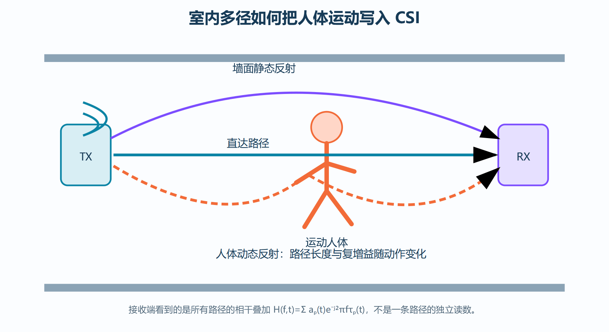
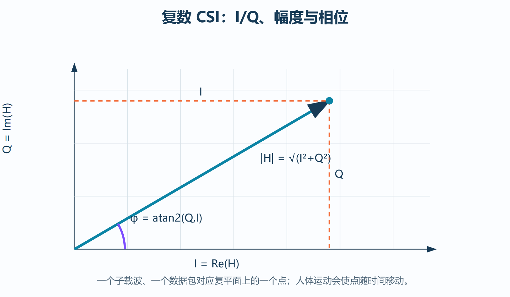
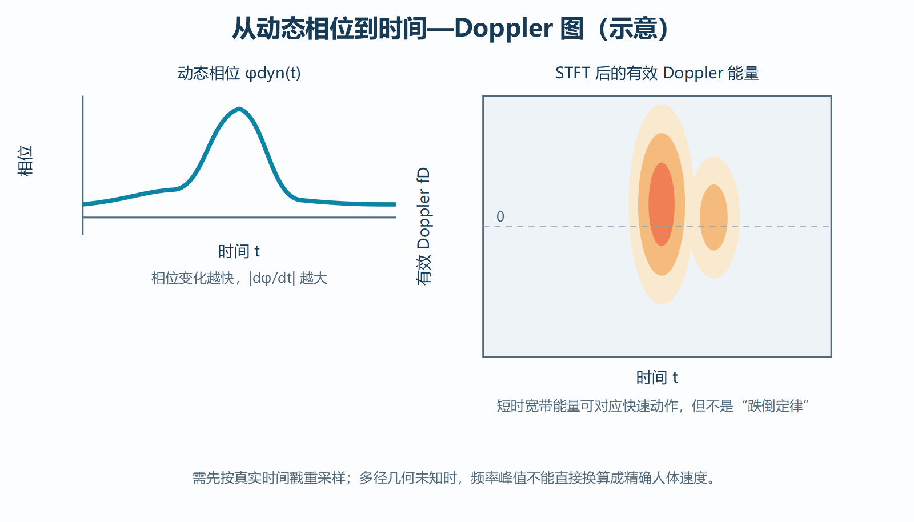
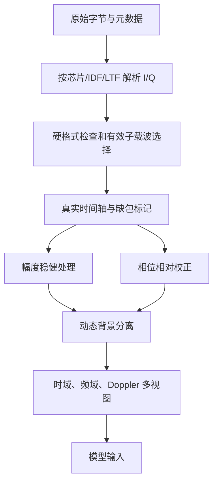
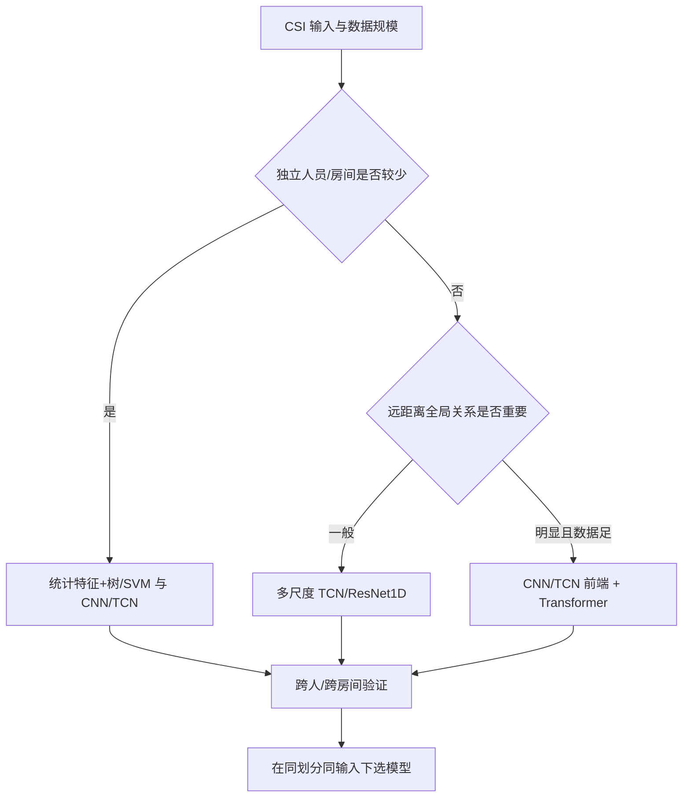
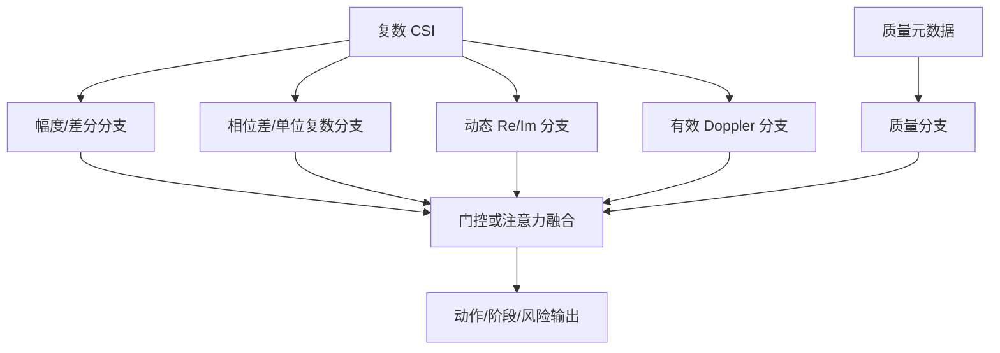
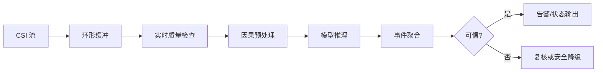

# Wi-Fi CSI 复数信道感知应用：从 OFDM 信道到人体动作识别

> 本文面向希望使用 ESP32/Wi-Fi CSI 开展人体感知、动作识别、跌倒检测、ISAC 或 AI 实验的读者。内容从通信模型开始，逐步推导复数 CSI 为什么能感知人体运动，并说明采集、特征、深度网络、跨域实验和可信决策怎样连成完整系统。

配套文档：[CSI 复数信道相位校正](./CSI复数信道相位校正.md)。如果要使用 I/Q、相位差或 Doppler，建议同时阅读相位校正文档。

---

## 目录

1. [先建立全局直觉](#1-先建立全局直觉)
2. [从发送符号推导 CSI](#2-从发送符号推导-csi)
3. [OFDM 为什么能提供子载波级信道](#3-ofdm-为什么能提供子载波级信道)
4. [复数 I/Q、幅度与相位](#4-复数-iq幅度与相位)
5. [多径传播怎样把人体运动写入 CSI](#5-多径传播怎样把人体运动写入-csi)
6. [静态多径、动态多径与可观测性](#6-静态多径动态多径与可观测性)
7. [从路径长度变化推导 Doppler](#7-从路径长度变化推导-doppler)
8. [CSI 数据表示与预处理](#8-csi-数据表示与预处理)
9. [感知特征体系](#9-感知特征体系)
10. [时频分析与有效 micro-Doppler](#10-时频分析与有效-micro-doppler)
11. [采集系统与元数据设计](#11-采集系统与元数据设计)
12. [窗口、标签与连续事件](#12-窗口标签与连续事件)
13. [机器学习与深度网络选择](#13-机器学习与深度网络选择)
14. [物理引导的多分支网络](#14-物理引导的多分支网络)
15. [跨人员、跨房间与域泛化](#15-跨人员跨房间与域泛化)
16. [质量、不确定性与选择性预测](#16-质量不确定性与选择性预测)
17. [实验设计、基线和消融](#17-实验设计基线和消融)
18. [部署与在线监测](#18-部署与在线监测)
19. [常见错误](#19-常见错误)
20. [实践检查表](#20-实践检查表)
21. [公式速查](#21-公式速查)
22. [进一步学习](#22-进一步学习)

---

## 1. 先建立全局直觉

Wi-Fi 发射机发送的电磁波不会只沿一条直线到达接收机。它会经过墙壁、地面、家具和人体反射，形成多条不同长度、不同衰减的传播路径。接收端测到的是这些路径的**复数相干叠加**。

人体移动时，一部分路径长度和反射强度随时间变化，于是接收端估计到的复数信道也随时间变化。CSI 感知的核心就是：

\[
\text{人体动作}
\rightarrow
\text{传播路径变化}
\rightarrow
\text{复数信道变化}
\rightarrow
\text{可学习的时间—频率模式}
\]

需要立即记住三点：

1. CSI 不是摄像头图像，它观察的是路径叠加的变化。
2. CSI 通常不能唯一反演每一条真实路径或人体精确姿态。
3. 单天线、非同步 ESP32 更适合提取**相对变化、动态多径和有效 Doppler**，而不是绝对相位、精确距离或精确速度。

### 1.1 完整感知系统

系统中任何一层出错，最终准确率都可能是假的。例如：I/Q 顺序解析错、相邻窗口泄漏、动作与人员标签绑定、模型靠 AGC 或房间指纹分类。

---

## 2. 从发送符号推导 CSI

### 2.1 窄带平坦衰落模型

最简单的复基带模型为：

\[
y=h x+n
\]

其中：

- \(x\in\mathbb C\)：已发送符号；
- \(h\in\mathbb C\)：复数信道系数；
- \(n\in\mathbb C\)：噪声和干扰；
- \(y\in\mathbb C\)：接收符号。

若接收机知道训练符号或导频 \(x\neq0\)，最简单的最小二乘估计为：

\[
\hat h=\frac{y}{x}
\]

因为：

\[
\frac{y}{x}=h+\frac{n}{x}
\]

当信噪比较高时，\(n/x\) 较小，\(\hat h\) 接近有效信道。

### 2.2 向量和矩阵形式

对多个子载波：

\[
Y[t,k]=H[t,k]X[t,k]+N[t,k]
\]

若保存 \(T\) 个包、\(S\) 个有效子载波：

\[
\mathbf H\in\mathbb C^{T\times S}
\]

若还有 \(R\) 个接收天线或链路：

\[
\mathbf H\in\mathbb C^{T\times S\times R}
\]

真实设备给出的 CSI 是经过同步、FFT、信道估计和硬件处理后的**有效信道估计**，不等于纯粹自由空间传播函数。

### 2.3 CSI 与 RSSI 的区别

RSSI 常是整包接收功率的粗粒度指标，而 CSI 保留子载波级复数结构：

| 信息 | RSSI | CSI |
|---|---:|---:|
| 整体功率 | 有 | 有/可间接反映 |
| 子载波频率选择性 | 无 | 有 |
| 复数相位 | 无 | 有 |
| 多径细节 | 很少 | 相对更多 |
| 人体微小动态 | 能力有限 | 更敏感 |

因此 CSI 通常比 RSSI 更适合细粒度感知，但对解析、同步和质量控制也更敏感。

---

## 3. OFDM 为什么能提供子载波级信道

### 3.1 宽带多径问题

时域多径信道可写为：

\[
h(t,\tau)=\sum_{p=1}^{P}a_p(t)\delta(\tau-\tau_p(t))
\]

接收信号是卷积：

\[
y(t)=\int h(t,\tau)x(t-\tau)d\tau+n(t)
\]

宽带系统中不同延迟路径会造成码间干扰。OFDM 把宽带划分为多个窄带正交子载波，并用循环前缀缓解多径卷积。

### 3.2 频域对角化

当循环前缀足够覆盖有效时延扩展并完成 FFT 后，每个子载波近似满足：

\[
Y_k=H_kX_k+N_k
\]

这把时域卷积转成各子载波上的乘法，使接收机可以分别估计 \(H_k\)。

### 3.3 子载波频率

\[
f_k=f_c+k\Delta f
\]

其中 \(f_c\) 是中心频率，\(\Delta f\) 是子载波间隔。多径相位项随频率变化：

\[
e^{-j2\pi f_k\tau_p}
\]

因此不同子载波对同一组路径的相干叠加不同，形成频率选择性结构。

### 3.4 相干带宽直觉

时延扩展越大，频率响应变化越快，相干带宽通常越小。粗略关系可写为：

\[
B_c\propto\frac{1}{\tau_{rms}}
\]

比例系数取决于相关性定义，不能当精确公式。它帮助理解：相邻子载波可能相关，但跨很远的子载波结构会不同。

### 3.5 子载波不是任意图像像素

将 CSI 画成“时间 × 子载波”图非常有用，但两个轴有明确物理意义。数据处理必须尊重：

- 空子载波、保护带和 DC 子载波；
- 导频和不同 LTF 的布局；
- 20/40 MHz 等带宽差异；
- 芯片和固件的输出顺序；
- 子载波是否连续、是否跨不同训练字段。

不能因为一行有 104 个整数，就永久假设为 52 个相同布局的复数子载波。

---

## 4. 复数 I/Q、幅度与相位

### 4.1 为什么用复数

窄带正弦信号可由两个相差 \(90^\circ\) 的基函数表示：

\[
s(t)=I\cos(2\pi f_ct)-Q\sin(2\pi f_ct)
\]

把它写成复包络：

\[
H=I+jQ
\]

其中 \(j^2=-1\)。复数同时编码大小和角度。

### 4.2 直角坐标与极坐标

\[
H=I+jQ=|H|e^{j\phi}
\]

由欧拉公式：

\[
e^{j\phi}=\cos\phi+j\sin\phi
\]

所以：

\[
I=|H|\cos\phi,\qquad Q=|H|\sin\phi
\]

平方相加：

\[
I^2+Q^2=|H|^2(\cos^2\phi+\sin^2\phi)=|H|^2
\]

得到幅度：

\[
|H|=\sqrt{I^2+Q^2}
\]

相位必须用：

\[
\phi=\operatorname{atan2}(Q,I)
\]

不能只用 \(\arctan(Q/I)\)，因为它不能区分象限，且 \(I=0\) 时出问题。

### 4.3 功率与分贝

若幅度为 \(|H|\)，功率量通常与 \(|H|^2\) 成比例。相对功率分贝：

\[
P_{dB}=10\log_{10}|H|^2=20\log_{10}|H|
\]

但 ESP32 CSI 的数值可能受到 AGC 和量化影响，不能未经校准就解释为绝对物理功率。

### 4.4 有符号 I/Q 解析

若固件输出 int8，字节 `255` 的位模式对应 \(-1\)，不是 \(+255\)。必须：

1. 按有符号 8 位解析；
2. 确认排列是 `[imag, real]` 还是 `[real, imag]`；
3. 确认 LTF、有效长度和子载波索引；
4. 用已知静态数据和固件说明验证。

---

## 5. 多径传播怎样把人体运动写入 CSI

### 5.1 频率响应推导

由时域冲激响应：

\[
h(t,\tau)=\sum_pa_p(t)\delta(\tau-\tau_p(t))
\]

对延迟 \(\tau\) 做傅里叶变换：

\[
H(t,f)=\int h(t,\tau)e^{-j2\pi f\tau}d\tau
\]

代入 \(h\)：

\[
H(t,f)=\sum_pa_p(t)e^{-j2\pi f\tau_p(t)}
\]

对第 \(k\) 个子载波：

\[
H[t,k]=\sum_pa_p(t)e^{-j2\pi f_k\tau_p(t)}
\]

这就是 CSI 感知的核心多径模型。

### 5.2 人体影响哪些量

人体动作可能改变：

- 路径是否存在或被遮挡；
- 反射复增益 \(a_p(t)\)；
- 路径长度 \(d_p(t)\)；
- 时延 \(\tau_p(t)=d_p(t)/c\)；
- 相位 \(-2\pi f_k\tau_p(t)\)；
- 多条路径之间的相长或相消关系。

即使人体只移动几厘米，载波相位也可能明显变化。例如波长：

\[
\lambda=\frac{c}{f_c}
\]

在 5 GHz 附近，\(\lambda\) 约为 6 cm；但实际反射几何与路径组合复杂，不能把某个相位变化直接等同于人体平移距离。

### 5.3 相干叠加为什么会同时改变幅度和相位

考虑两条路径：

\[
H=a_1e^{j\phi_1}+a_2e^{j\phi_2}
\]

其功率：

\[
|H|^2=a_1^2+a_2^2+2a_1a_2\cos(\phi_1-\phi_2)
\]

当人体运动改变第二条路径相位 \(\phi_2\) 时，余弦交叉项变化，因此总幅度也会波动。这说明：幅度感知并非只来自“遮挡造成能量下降”，还来自多径相干叠加。

---

## 6. 静态多径、动态多径与可观测性

### 6.1 近似分解

在有限时间窗内，可写为：

\[
H(t,k)=H_{static}(t,k)+H_{dynamic}(t,k)+n(t,k)
\]

- 静态项：墙体、固定家具、设备位置等缓慢背景；
- 动态项：人体、宠物、风扇、门窗等运动散射体；
- 噪声项：接收噪声、干扰、估计和硬件误差。

“静态”是相对于分析时间尺度而言。几分钟内静态的环境，几天后可能因家具或温度变化而不同。

### 6.2 低通背景法

估计慢变背景：

\[
\hat H_{static}(t,k)=LPF_t\{H(t,k)\}
\]

动态残差：

\[
H_{dyn}(t,k)=H(t,k)-\hat H_{static}(t,k)
\]

若用指数移动平均：

\[
S_t=\beta S_{t-1}+(1-\beta)H_t
\]

\[
H_{dyn,t}=H_t-S_t
\]

\(\beta\) 越接近 1，背景变化越慢。窗口太短会把慢动作吸进背景；窗口太长会保留环境漂移。

### 6.3 滑动均值的频率意义

长度 \(L\) 的移动平均：

\[
S_t=\frac1L\sum_{i=0}^{L-1}H_{t-i}
\]

等价于一个低通滤波器。动态残差相当于高通成分。其截止特性与采样率和 \(L\) 共同决定，因此必须报告真实包速率，而不能只写“窗口 20 个包”。

### 6.4 不能唯一反演的原因

接收端只看到所有路径的总和，而未知量包括每条路径的增益、时延、角度和运动。单天线、有限带宽下观测维度不足，多个不同场景可能产生相似 CSI。因此动作识别是统计模式识别，不是完整三维电磁逆问题。

---

## 7. 从路径长度变化推导 Doppler

### 7.1 单条动态路径

设动态路径长度为 \(d(t)\)，时延：

\[
\tau(t)=\frac{d(t)}{c}
\]

相位：

\[
\phi(t)=-2\pi f_c\tau(t)=-\frac{2\pi}{\lambda}d(t)
\]

对时间求导：

\[
\frac{d\phi(t)}{dt}=-\frac{2\pi}{\lambda}\frac{dd(t)}{dt}
\]

定义相位旋转频率：

\[
f_D=\frac1{2\pi}\frac{d\phi}{dt}
\]

得到：

\[
f_D=-\frac1\lambda\frac{dd(t)}{dt}
\]

若 \(v_r=dd/dt\) 是路径长度变化率：

\[
f_D=-\frac{v_r}{\lambda}
\]

### 7.2 为什么有时出现 \(2v/\lambda\)

单基地雷达中电波往返同一目标，路径长度变化约为目标径向位移的两倍，所以：

\[
f_D\approx\frac{2v_r}{\lambda}
\]

Wi-Fi 通信感知通常是双基地或复杂多径几何，系数依赖发射方向、接收方向和人体运动方向。不能固定套用 1 或 2 来估精确速度。

### 7.3 多径中的“有效 Doppler”

真实 CSI 是多个 Doppler 分量和静态分量的叠加：

\[
H(t)=H_s+\sum_pa_pe^{j2\pi f_{D,p}t}
\]

单个子载波的总相位导数不一定等于某一肢体速度。因此更稳妥的说法是：从动态复数 CSI 提取**有效 Doppler 或 micro-Doppler 统计结构**。

---

## 8. CSI 数据表示与预处理

### 8.1 处理流程

### 8.2 硬检查与软处理

硬检查可在全数据统一执行，因为它只判断格式是否合法：

- I/Q 数量是否为偶数；
- 声明长度是否匹配；
- 时间戳是否可解析；
- LTF/带宽布局是否已知；
- 文件是否损坏。

软处理会学习数据分布，必须只在训练折拟合：

- 均值和标准差；
- PCA/ICA；
- 异常阈值；
- 滤波超参数选择；
- 特征选择；
- 校准温度和分类/拒识阈值。

### 8.3 幅度压缩

\[
x_{t,k}=\log(1+|H_{t,k}|)
\]

`log1p` 压缩大值，减轻极端幅度影响。可做每包稳健中心化：

\[
\tilde x_{t,k}=x_{t,k}-\operatorname{median}_{j\in\mathcal K}x_{t,j}
\]

这有助于降低整包增益变化，但也移除了跨包整体强度信息，因此应保留原始质量元数据并做消融。

### 8.4 标准化

每子载波训练集标准化：

\[
z_{t,k}=\frac{x_{t,k}-\mu_k^{train}}{\sigma_k^{train}+\epsilon}
\]

验证和测试只能使用训练集的 \(\mu_k^{train},\sigma_k^{train}\)。

### 8.5 时间重采样

STFT、速度相关差分和固定长度模型通常假设均匀时间间隔。若包时间戳为 \(t_i\)，应：

1. 检查单调性和重复时间；
2. 计算 \(\Delta t_i=t_i-t_{i-1}\)；
3. 标记较大 gap；
4. 根据允许缺口插值或切断序列；
5. 重采样到目标频率 \(f_s\)；
6. 保存缺包 mask，避免把插值当真实观测。

### 8.6 缺包处理

短缺口可使用线性、样条或复平面插值，但相位必须在复数域或正确展开后处理。长缺口应切断窗口或标为低质量，不宜凭空补齐完整动作。

### 8.7 相位输入

推荐候选：

- 去趋势相位的 \(\sin\phi,\cos\phi\)；
- 子载波共轭相位差；
- 时间共轭相位差；
- 单位复数 \(H/(|H|+\epsilon)\)；
- 校正后复数动态残差的 Re/Im。

详细推导见[相位校正文档](./CSI复数信道相位校正.md)。

---

## 9. 感知特征体系

### 9.1 特征分层

| 层次 | 例子 | 作用 |
|---|---|---|
| 原始复数 | Re/Im、幅度、相对相位 | 最大程度保留信息 |
| 时间动态 | 一阶/二阶差分、动态能量 | 捕获速度和突变 |
| 频率结构 | 子载波相关、频率差分 | 描述多径频选特征 |
| 时频结构 | STFT、Doppler 能量、谱熵 | 描述动作随时间演化 |
| 统计特征 | 均值、方差、分位数、峰度 | 传统 ML 和诊断 |
| 质量特征 | gap、RSSI、AGC、残差 | 风险估计和审计 |

### 9.2 一阶时间差

固定包间隔时：

\[
\Delta H_t=H_t-H_{t-1}
\]

不等间隔时更合理：

\[
\dot H_t\approx\frac{H_t-H_{t-1}}{t_t-t_{t-1}}
\]

差分抑制慢背景，但放大高频噪声。

### 9.3 二阶时间差

\[
\ddot H_t\approx
\frac{\dot H_t-\dot H_{t-1}}{t_t-t_{t-1}}
\]

它与突变或“加速度式变化”相关，但不等同人体真实加速度，因为 \(H\) 是多径复数叠加。

### 9.4 动态能量

\[
E_{dyn}(t)=\sum_{k\in\mathcal K}|H_{dyn}(t,k)|^2
\]

窗口平均：

\[
\bar E_{dyn}=\frac1T\sum_tE_{dyn}(t)
\]

强动作可能有高动态能量，但“能量大=跌倒”不成立。跳跃、奔跑、挥手或设备移动都可能更强。

### 9.5 动静比

\[
R_{DS}=rac{\sum_{t,k}|H_{dyn}(t,k)|^2}
{\sum_{t,k}|H_{static}(t,k)|^2+\epsilon}
\]

该比值对静态估计时间尺度敏感，必须固定或在训练侧选择。

### 9.6 跨子载波相关

对两个子载波 \(k,m\)：

\[
\rho_{k,m}=\frac{\operatorname{Cov}(x_k,x_m)}
{\sigma_k\sigma_m}
\]

可形成相关矩阵，描述多径共同变化。但平滑、插值和滤波会人为提高相关性。

### 9.7 统计特征

对每个窗口可提取：均值、标准差、MAD、分位差、偏度、峰度、零交叉率、峰值数、谱质心、谱带宽、谱熵等。传统模型中应先做训练侧特征选择，避免高维小样本过拟合。

---

## 10. 时频分析与有效 micro-Doppler

### 10.1 为什么普通 FFT 不够

整段 FFT 只告诉“有哪些频率”，不告诉它们在何时出现。动作是非平稳过程，需要时频表示。

### 10.2 STFT 推导

对信号 \(x[n]\)，在中心帧 \(m\) 附近乘窗 \(w[n-mR]\)：

\[
X[m,\omega]=\sum_nx[n]w[n-mR]e^{-j\omega n}
\]

其中 \(R\) 是 hop。功率谱：

\[
P[m,\omega]=|X[m,\omega]|^2
\]

### 10.3 时间—频率分辨率权衡

- 短窗：时间定位好，频率分辨率差；
- 长窗：频率分辨率好，动作边界被平滑；
- hop 小：时间采样密，但相邻帧高度相关、计算更多。

频率分辨率粗略为：

\[
\Delta f=\frac{f_s}{N_{FFT}}
\]

但零填充只使频率网格更密，不增加真实分辨能力。

### 10.4 子载波聚合

可选方法：

1. 每个子载波做 STFT 后能量稳健聚合；
2. 对动态复数矩阵做训练侧 PCA，再对主成分做 STFT；
3. 复数协方差特征分解；
4. 让神经网络学习子载波融合；
5. 多接收链做空间—时间融合。

PCA 必须只在训练折拟合。

### 10.5 谱特征

归一化谱：

\[
p_i=\frac{P_i}{\sum_jP_j+\epsilon}
\]

谱熵：

\[
H_{spec}=-\sum_ip_i\log p_i
\]

谱质心：

\[
f_c=\frac{\sum_if_iP_i}{\sum_iP_i}
\]

正/负 Doppler 能量比可能与运动方向有关，但多径和硬件公共相位会影响其可靠性，需要校正和几何对照。

---

## 11. 采集系统与元数据设计

### 11.1 为什么原始数据必须可重解析

只导出幅度 CSV 会永久失去：

- I/Q 相干关系；
- 相位差和单位复数；
- 复数动态残差；
- Doppler 的复数方向信息；
- 未来更好的校正方法。

因此建议原样保存有符号 I/Q，并在 manifest 声明格式。

### 11.2 最低字段集

| 类别 | 建议字段 | 用途 |
|---|---|---|
| 身份 | recording_id、experiment_id、trial | 追溯与去重 |
| 域 | participant、room、date、session | 严格分组划分 |
| 标签 | action、phase、start/end | 分类与事件定位 |
| 时间 | device timestamp、PC UTC、packet seq | 重采样、丢包和时延 |
| PHY | channel、bandwidth、MCS、GI、LTF | 控制帧与子载波布局 |
| 设备 | chip、IDF、MAC、antenna、firmware hash | 复现和跨设备分析 |
| 质量 | RSSI、noise floor、AGC、rx_state | 质量建模 |
| 几何 | TX/RX/人员位置、距离、高度、朝向 | 解释多径与域变化 |
| 完整性 | SHA-256、status、aborted reason | 审计和重采 |

### 11.3 研究发射端的价值

研究发射端可以固定：

- 目标包序号和 experiment ID；
- payload 长度与内容；
- 发送间隔；
- 信道、带宽、帧型和 MCS（在硬件/API 允许范围内）；
- 成功/失败计数。

它能提高流量可控性和丢包统计，但两个设备仍有独立晶振，不能仅靠 payload 获得绝对相位同步。

### 11.4 每个 session 的校准试次

建议顺序：

1. 空房静态；
2. 人员站立静止；
3. 已知小幅周期运动，例如匀速摆动反射板或固定节奏摆臂；
4. 混淆动作；
5. 目标动作；
6. session 结束时再次空房静态。

这能判断设备是否移动、信号是否漂移、相位校正是否有效。

### 11.5 不应悄悄删除失败记录

失败采集应保留状态：`aborted`、`quality_warning`、失败原因和对应重采 recording_id。若测试时按质量软规则删除难例，会高估系统性能。

---

## 12. 窗口、标签与连续事件

### 12.1 固定窗口分类

输入 \(T_w\) 秒窗口，输出一个动作类别。优点是简单；缺点是依赖动作恰好落在窗口内。

### 12.2 滑窗与重叠

窗口长度 \(L\)，步长 \(R\)，重叠率：

\[
r_{overlap}=1-\frac{R}{L}
\]

高重叠产生大量高度相关样本。必须先按完整 recording/session/person 划分，再在集合内部切窗。

### 12.3 动作阶段标签

跌倒可分为：准备、失衡/下降、冲击、倒地后静止。阶段标签有助于定位和解释，但人工标注误差较大，应定义清晰准则和标注一致性。

### 12.4 连续事件检测

模型输出逐帧概率 \(p_t\)，再进行事件聚合：

- 阈值；
- 最短持续时间；
- 合并短间隔；
- 冷却时间；
- 事件开始/结束定位。

事件级评价需定义预测区间与真实区间是否匹配，可使用 IoU 或允许时间容差。

### 12.5 标签体系建议

除了跌倒和无人，应包含现实混淆：

- 正常走路、快速走、转身；
- 坐下、站起；
- 主动躺下、床上翻身；
- 弯腰捡物；
- 蹲下、起身；
- 跳跃或剧烈挥动；
- 房间内其他人/宠物移动；
- 设备或家具移动。

只比较“跌倒 vs 无人”不能证明真实跌倒检测能力。

---

## 13. 机器学习与深度网络选择

### 13.1 传统机器学习基线

统计/谱特征 + SVM、随机森林、XGBoost 是必需基线，尤其在独立人员很少时。它们参数少、数据效率高，能检验深度模型是否真正学习到额外表示。

### 13.2 1D CNN

对时间轴卷积：

\[
y_t=\sum_{i=0}^{K-1}w_ix_{t-i}
\]

适合局部动作动态，参数共享，通常是强基线。

### 13.3 2D CNN

将时间×子载波作为二维结构，适合局部时频模式。但子载波轴不是普通空间像素，应明确布局和卷积假设。

### 13.4 TCN

膨胀卷积：

\[
y_t=\sum_{i=0}^{K-1}w_ix_{t-di}
\]

不同 dilation 捕获短时冲击、中期阶段和长时上下文。中小规模 CSI 数据中通常值得优先尝试。

### 13.5 LSTM/GRU

适合顺序状态和变长序列，但时间步串行，长序列训练较慢。双向模型使用未来信息，不适合严格实时因果部署。

### 13.6 Transformer

\[
Attention(Q,K,V)=softmax\left(\frac{QK^T}{\sqrt{d_k}}\right)V
\]

适合全局阶段关系和大规模自监督预训练。标准注意力成本随 token 数近似二次增长，小数据可能过拟合。

### 13.7 推荐选择流程

---

## 14. 物理引导的多分支网络

### 14.1 为什么分支化

幅度、相对相位、复数动态和 Doppler 的统计性质不同。分支编码后融合能保留各自归纳偏置：

### 14.2 物理一致性

同一样本的两个合理观测变换 \(T_1,T_2\) 应有相似表示：

\[
\mathcal L_{cons}=\|E(T_1(x))-E(T_2(x))\|_2^2
\]

合理不变量候选：

- 全局公共相位旋转；
- 允许范围的包内线性相位斜坡；
- 轻度缺包或采样密度变化；
- 合理整体幅度尺度变化；
- 不改变动作语义的小时间偏移。

这些增强必须按真实硬件误差范围设计。

### 14.3 总损失示例

\[
\mathcal L=
\mathcal L_{cls}+lambda_{dom}\mathcal L_{dom}
+\lambda_{q}\mathcal L_{quality}
+\lambda_{cons}\mathcal L_{cons}
+\lambda_{sel}\mathcal L_{selective}
\]

每一项都需要单独消融。模块多不等于创新强，关键是每项是否解决真实失败模式。

---

## 15. 跨人员、跨房间与域泛化

### 15.1 域是什么

一个域可由人员、房间、设备、位置、朝向、日期和网络状态共同定义。域变化会改变静态多径、幅度尺度、相位误差和动作执行方式。

### 15.2 正确划分

| 协议 | 留出单位 | 能支持的结论 |
|---|---|---|
| 随机窗口 | 相似窗口 | 仅管线调试，易泄漏 |
| Leave-one-session-out | 完整会话 | 跨会话 |
| Leave-one-date-out | 完整日期 | 跨时间 |
| Leave-one-person-out | 完整人员 | 跨人员 |
| Leave-one-room-out | 完整房间 | 跨环境 |
| 封存组合域 | 人员+房间+日期 | 最终部署式证据 |

### 15.3 域对抗学习

共享编码器 \(E\) 同时服务动作分类器 \(C\) 和域分类器 \(D\)：

\[
\mathcal L_{cls}=CE(C(E(x)),y)
\]

\[
\mathcal L_{dom}=CE(D(E(x)),d)
\]

通过梯度反转让编码器降低动作损失、提高域分类困难：

\[
\min_{E,C}\max_D
\mathcal L_{cls}-\lambda\mathcal L_{dom}
\]

域信息与类别信息可能耦合，过强对齐会伤害分类。最终只能由未见域结果判断。

### 15.4 自监督预训练

大量无标签 CSI 可进行：

- 遮挡时间/子载波恢复；
- 未来片段预测；
- 同一 recording 的物理合理视图对比；
- 时间顺序判断；
- 跨分支一致性。

正负样本定义必须防止同一动作不同人员被错误推远，或相邻窗口泄漏到测试。

---

## 16. 质量、不确定性与选择性预测

### 16.1 为什么 Softmax 不够

模型即使遇到完全未知动作，也会把概率分配给已知类别。高 Softmax 置信度不保证正确，更不保证目标域可靠。

### 16.2 质量特征

\[
q=[r_{loss},\sigma_{\Delta t},RSSI,noise,AGC,
r_{invalid},r_{sat},e_{phase},\ldots]
\]

质量分支应辅助估计“当前观测是否可靠”，不能让模型把房间特有 AGC 当动作捷径。

### 16.3 不确定性

MC Dropout 或深度集成：

\[
\bar p(y|x)=\frac1M\sum_{m=1}^Mp_m(y|x)
\]

预测熵：

\[
H(p)=-\sum_cp_c\log p_c
\]

模型间分歧可表示认知不确定性近似，但需要校准验证。

### 16.4 选择性预测

模型可以拒绝：

\[
g(x)=\mathbb 1[s_{risk}(x)<\tau]
\]

覆盖率：

\[
C=\frac1N\sum_ig(x_i)
\]

选择性风险：

\[
R_{sel}=\frac{\sum_i g(x_i)\ell_i}{\sum_ig(x_i)+\epsilon}
\]

应报告完整 risk–coverage 曲线和 AURC，防止模型靠拒绝绝大多数样本获得低风险。

### 16.5 校准

温度缩放：

\[
p_c=softmax(z_c/T)
\]

\(T\) 只能在验证集学习。报告 ECE、Brier、NLL 和可靠性图，并检查不同人员、房间和质量层的校准。

---

## 17. 实验设计、基线和消融

### 17.1 最低基线集

1. 多数类/简单阈值；
2. 统计特征 + SVM；
3. 统计特征 + 随机森林/XGBoost；
4. 1D CNN/ResNet1D；
5. GRU 或 CNN-GRU；
6. TCN；
7. 轻量 Transformer；
8. CNN/TCN-Transformer；
9. 完整物理引导选择性网络。

### 17.2 输入消融

- amplitude only；
- amplitude + temporal difference；
- + phase difference；
- + corrected complex Re/Im；
- + Doppler；
- + quality metadata；
- full multi-view。

### 17.3 模块消融

- 去掉物理一致性；
- 去掉域分支；
- 去掉质量分支；
- 去掉不确定性/原型；
- 去掉选择性头；
- 更换骨干；
- 参数量匹配的普通模块替代。

### 17.4 指标

识别：Macro-F1、每类 precision/recall、fall recall、specificity、F2、AUROC、AUPRC。

事件：事件级 recall、每小时误报、检测延迟、区间 IoU。

校准：NLL、Brier、ECE。

开放/选择性：未知 AUROC/AUPR、FPR@95TPR、risk–coverage、AURC、review rate。

系统：有效包率、帧率、丢包、预处理和推理延迟、内存、能耗。

### 17.5 统计报告

按人员/session bootstrap，而不是按相邻窗口。报告每个留出域、均值、标准差、95% 置信区间和最差域。

---

## 18. 部署与在线监测

### 18.1 在线管线

实时系统不能使用未来帧、双向网络或整段动作全局统计，除非明确允许检测延迟。

### 18.2 漂移监测

监测：输入幅度分布、丢包、RSSI、质量分数、embedding 距离、预测熵、类别比例和人工复核反馈。漂移出现后不能自动用未经审核的伪标签更新高风险模型。

### 18.3 决策成本

若漏报成本 \(C_{FN}\) 远高于误报成本 \(C_{FP}\)，决策阈值应基于验证集成本：

\[
Risk=C_{FN}FN+C_{FP}FP+C_RReview
\]

部署阈值不是固定 0.5 的必然选择。

---

## 19. 常见错误

| 错误说法/做法 | 为什么错 | 正确做法 |
|---|---|---|
| CSI 幅度下降就是人体遮挡 | 多径相干叠加可增可减 | 使用动态与多场景验证 |
| 原始相位就是真实传播相位 | 混入 CFO/SFO/PDD | 做相对校正并限制主张 |
| Doppler 峰值就是人体速度 | 多径几何未知 | 称有效 Doppler，校准后再估速 |
| 重叠窗口随机划分 | 相邻样本泄漏 | 先按 recording/person/room 划分 |
| 全数据标准化后交叉验证 | 测试统计泄漏 | 每折仅在训练侧拟合 |
| 随机划分 99% 即可部署 | 不代表跨人跨房间 | 使用域独立测试 |
| 只采跌倒和无人 | 任务过于简单 | 加入丰富混淆动作 |
| 删除低质量测试样本 | 高估现实性能 | 保留并报告质量分层/拒识 |
| Transformer 一定更好 | 依赖数据量和任务结构 | 同预算与 TCN/CNN 比较 |
| 注意力图证明因果 | 注意力只是内部权重 | 用干预、消融和跨域证据 |

---

## 20. 实践检查表

### 20.1 采集前

- [ ] 明确芯片、IDF、LTF、I/Q 顺序和 int8 格式。
- [ ] 固定信道、带宽、发射间隔、设备位置、天线方向。
- [ ] 设计 participant/room/date/session/recording ID。
- [ ] 定义动作起止、提示、重复次数和混淆动作。
- [ ] 设计空房、静止人体和周期运动校准。
- [ ] 记录 firmware/config hash。

### 20.2 采集后

- [ ] 检查文件 hash、长度、时间戳和序列 gap。
- [ ] 绘制幅度、原始相位、相对相位和 Doppler。
- [ ] 确认动作完整落在记录中。
- [ ] 标记失败而非静默删除。
- [ ] 检查不同标签是否与人员/房间/日期意外绑定。

### 20.3 建模前

- [ ] 先按人员/房间/session 分组划分。
- [ ] 预处理统计只在训练折拟合。
- [ ] 建立传统 ML、CNN/TCN 和 Transformer 基线。
- [ ] 为每个新分支定义物理理由和消融。
- [ ] 预先确定主要指标和阈值选择规则。

### 20.4 报告结果

- [ ] 报告每个留出域，而非只报总平均。
- [ ] 报告置信区间和多随机种子。
- [ ] 报告校准、选择性和未知输入。
- [ ] 报告参数、延迟、内存和能耗。
- [ ] 公布失败案例和适用范围。

---

## 21. 公式速查

| 名称 | 公式 | 用途 |
|---|---|---|
| 子载波信道 | \(Y_{t,k}=H_{t,k}X_{t,k}+N_{t,k}\) | CSI 来源 |
| 复数 CSI | \(H=I+jQ\) | I/Q 表示 |
| 幅度 | \(|H|=\sqrt{I^2+Q^2}\) | 反射/叠加强度 |
| 相位 | \(\phi=atan2(Q,I)\) | 测量角度 |
| 多径 | \(H=\sum_pa_pe^{-j2\pi f\tau_p}\) | 人体改变路径 |
| 动态残差 | \(H_{dyn}=H-LPF(H)\) | 抑制慢背景 |
| 相位—Doppler | \(f_D=(1/2\pi)d\phi/dt\) | 时间频率联系 |
| STFT | \(X[m,\omega]=\sum_nx[n]w[n-mR]e^{-j\omega n}\) | 非平稳动作 |
| 动态能量 | \(E=\sum_k|H_{dyn}|^2\) | 运动强度统计 |
| 选择性风险 | \(R=\sum g_i\ell_i/(\sum g_i+\epsilon)\) | 可信自动预测 |

---

## 22. 进一步学习

### 22.1 关键词

- OFDM channel estimation、pilot、cyclic prefix；
- multipath channel、delay spread、coherence bandwidth；
- complex CSI、I/Q imbalance、phase sanitization；
- micro-Doppler、STFT、time-frequency analysis；
- device-free sensing、Wi-Fi human activity recognition；
- domain generalization、open-set recognition、selective classification；
- calibration under distribution shift、uncertainty estimation；
- ESP-IDF CSI、LLTF/HT-LTF/HE-LTF。

### 22.2 参考资料

1. D. Halperin et al., *Tool Release: Gathering 802.11n Traces with Channel State Information*, ACM SIGCOMM CCR, 2011.
2. Y. Ma, G. Zhou, and S. Wang, *WiFi Sensing with Channel State Information: A Survey*, ACM Computing Surveys, 2019.
3. C. Han et al., *WiFall: Device-Free Fall Detection by Wireless Networks*, IEEE INFOCOM, 2014.
4. H. Wang et al., *RT-Fall: A Real-Time and Contactless Fall Detection System with Commodity WiFi Devices*, IEEE TMC, 2017.
5. Espressif Systems, ESP-IDF Wi-Fi CSI documentation and esp-radar documentation；应以实际芯片与 IDF 版本为准。
6. D. Varga, *Exposing Data Leakage in Wi-Fi CSI-Based Human Action Recognition: A Critical Analysis*, Inventions, 2024.

---

## 结语

CSI 感知真正困难的地方，不是把一个矩阵送进网络，而是保证从无线测量、复数解析、时间轴、特征和标签，到跨域验证和可信决策的每一步都成立。网络只能从你提供的数据中学习；若数据把房间、人员或硬件误差与动作绑定，再强的模型也可能只是在高效地学习错误答案。
