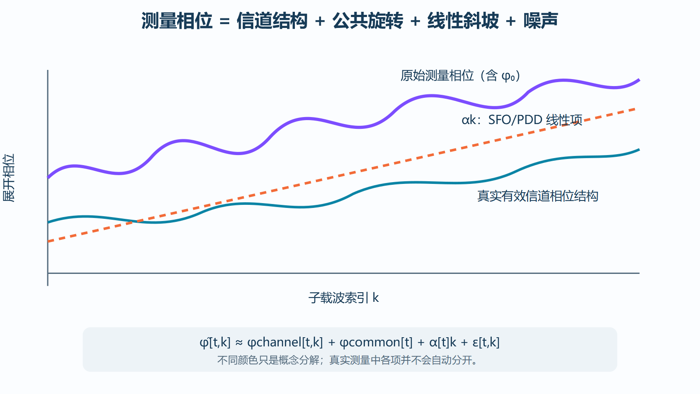
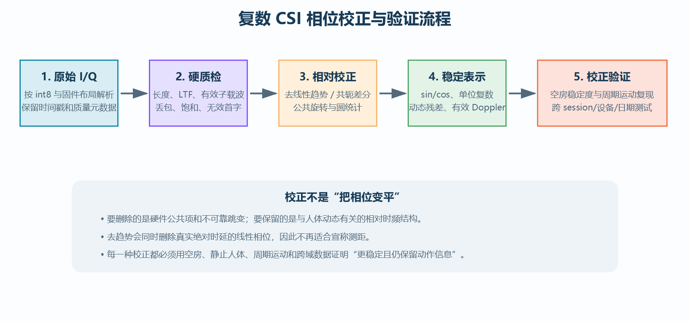
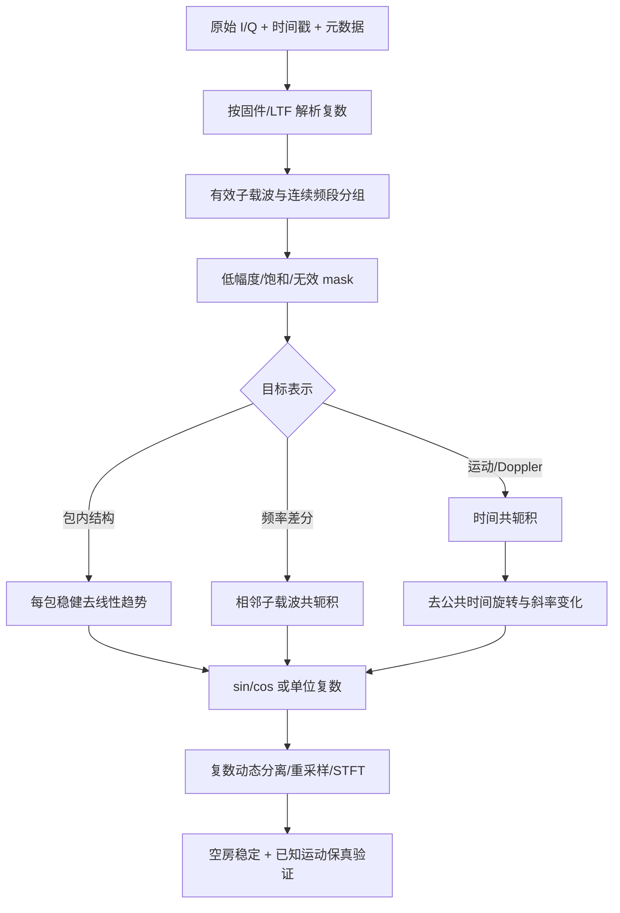
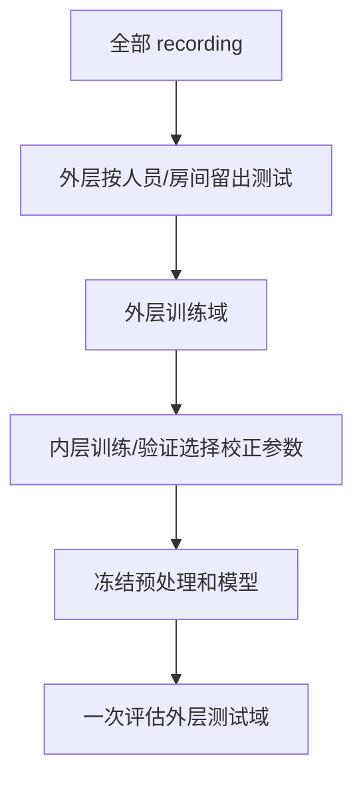

# Wi-Fi CSI 复数信道相位校正：从硬件误差到稳定相对相位

> 本文系统解释 Wi-Fi CSI 原始相位为什么不能直接视为真实传播相位，并从频移、时间偏移和复数运算出发，逐步推导 CFO、SFO、包检测延迟、相位环绕、共轭差分、去线性趋势、圆统计和质量验证方法。目标是得到适合动作识别与动态多径分析的**稳定相对相位表示**，而不是在条件不足时声称恢复绝对距离或绝对传播相位。

配套文档：[CSI 复数信道感知应用](./CSI复数信道感知应用.md)。

---

## 目录

1. [一句话理解相位问题](#1-一句话理解相位问题)
2. [复数相位的数学基础](#2-复数相位的数学基础)
3. [理想传播相位与时延](#3-理想传播相位与时延)
4. [实际 CSI 测量相位模型](#4-实际-csi-测量相位模型)
5. [CFO 的来源与推导](#5-cfo-的来源与推导)
6. [SFO 的来源与推导](#6-sfo-的来源与推导)
7. [包检测延迟和 FFT 窗口偏移](#7-包检测延迟和-fft-窗口偏移)
8. [AGC、量化、饱和与 I/Q 失衡](#8-agc量化饱和与-iq-失衡)
9. [相位环绕、展开与圆统计](#9-相位环绕展开与圆统计)
10. [校正前的数据解析与质量检查](#10-校正前的数据解析与质量检查)
11. [方法一：包内线性去趋势](#11-方法一包内线性去趋势)
12. [方法二：子载波共轭相位差](#12-方法二子载波共轭相位差)
13. [方法三：时间共轭相位差](#13-方法三时间共轭相位差)
14. [方法四：参考子载波、参考包和参考天线](#14-方法四参考子载波参考包和参考天线)
15. [稳定表示：sin/cos 与单位复数](#15-稳定表示sincos-与单位复数)
16. [复数域的静态与动态分离](#16-复数域的静态与动态分离)
17. [由校正相位提取有效 Doppler](#17-由校正相位提取有效-doppler)
18. [完整相位校正流水线](#18-完整相位校正流水线)
19. [如何证明校正确实有效](#19-如何证明校正确实有效)
20. [参数选择与训练集泄漏](#20-参数选择与训练集泄漏)
21. [面向神经网络的相位输入](#21-面向神经网络的相位输入)
22. [不同硬件条件下能做到什么](#22-不同硬件条件下能做到什么)
23. [常见错误与错误主张](#23-常见错误与错误主张)
24. [实现伪代码](#24-实现伪代码)
25. [实验与消融设计](#25-实验与消融设计)
26. [检查表与重采标准](#26-检查表与重采标准)
27. [公式速查](#27-公式速查)
28. [进一步学习](#28-进一步学习)

---

## 1. 一句话理解相位问题

理想情况下，CSI 相位反映传播路径时延；实际 ESP32/Wi-Fi 接收机中，测到的相位还叠加了发射/接收晶振频差、采样时钟误差、每包 FFT 起点误差、公共初始相位和噪声：

\[
\hat\phi[t,k]
\approx
\phi_{channel}[t,k]
+\phi_{common}[t]
+\alpha[t]k
+\epsilon[t,k]
\]

因此：

> `atan2(Q,I)` 得到的是**原始测量相位**，不是自动等于真实传播相位。



在空房中，\(\phi_{channel}\) 可以基本不变，但 \(\phi_{common}\) 仍可能随包变化。把裸相位直接输入网络，网络可能学习晶振、温度、设备或 session 指纹。

### 1.1 校正的实际目标

对普通单天线、不同步 CSI，合理目标是：

- 抑制包间公共旋转；
- 抑制跨子载波近似线性斜坡；
- 避免 \(-\pi/\pi\) 环绕造成的假跳变；
- 保留人体动态引起的相对时频结构；
- 给低幅度、严重缺包或随机相位样本打质量标记；
- 用空房和已知运动证明校正后的稳定性与敏感性。

不是所有任务都需要恢复同一种相位：动作分类、Doppler、测距和 AoA 的要求不同。

---

## 2. 复数相位的数学基础

### 2.1 复数的两种形式

\[
H=I+jQ=|H|e^{j\phi}
\]

由欧拉公式：

\[
e^{j\phi}=\cos\phi+j\sin\phi
\]

因此：

\[
I=|H|\cos\phi,\qquad Q=|H|\sin\phi
\]

\[
|H|=\sqrt{I^2+Q^2},\qquad
\phi=\operatorname{atan2}(Q,I)
\]


### 2.2 复数乘法为什么会使相位相加

设：

\[
H_1=A_1e^{j\phi_1},\qquad H_2=A_2e^{j\phi_2}
\]

则：

\[
H_1H_2=A_1A_2e^{j(\phi_1+\phi_2)}
\]

所以复数乘法在相位上对应加法。

### 2.3 共轭为什么能做相位差

\[
H_2^*=A_2e^{-j\phi_2}
\]

于是：

\[
H_1H_2^*=A_1A_2e^{j(\phi_1-\phi_2)}
\]

取角度：

\[
\angle(H_1H_2^*)=operatorname{wrap}(\phi_1-\phi_2)
\]

这就是子载波差分和时间差分推荐使用共轭乘积的原因：它在复平面中直接计算最短圆周差，避免先取角度再相减产生的环绕问题。

### 2.4 归一化共轭积

若只关心相位差，可归一化：

\[
R_{12}=
\frac{H_1H_2^*}{|H_1||H_2|+\epsilon}
\]

理想时 \(|R_{12}|\approx1\)，其 Re/Im 就是相位差的 cos/sin：

\[
R_{12}\approx\cos\Delta\phi+j\sin\Delta\phi
\]

低幅度时相位噪声大，不能仅靠 \(\epsilon\) 掩盖，应设置可靠性权重或 mask。

---

## 3. 理想传播相位与时延

### 3.1 单条路径

若传播时延为 \(\tau\)，频率 \(f\) 上的相位项：

\[
H(f)=ae^{-j2\pi f\tau}
\]

传播相位：

\[
\phi(f)=\phi_a-2\pi f\tau
\]

其中 \(\phi_a\) 是复增益自身相位。

### 3.2 跨子载波线性相位

令：

\[
f_k=f_c+k\Delta f
\]

代入：

\[
\phi_k=phi_a-2\pi(f_c+k\Delta f)\tau
\]

整理：

\[
\phi_k=(\phi_a-2\pi f_c\tau)-2\pi\Delta f\tau\,k
\]

理想单路径情况下，相位随子载波索引 \(k\) 线性变化，斜率：

\[
s=\frac{d\phi_k}{dk}=-2\pi\Delta f\tau
\]

因此理论上：

\[
\tau=-\frac{s}{2\pi\Delta f}
\]

### 3.3 为什么室内 CSI 不能直接用斜率测距

真实多径：

\[
H(f)=\sum_pa_pe^{-j2\pi f\tau_p}
\]

总相位是复数和的角度：

\[
\phi(f)=\angle\left(\sum_pa_pe^{-j2\pi f\tau_p}\right)
\]

它一般不等于各路径相位的简单平均。此外，SFO/PDD 也产生线性斜率，有限带宽限制时延分辨率。因此普通 CSI 相位斜率不能无条件换成绝对距离。

### 3.4 时延分辨率直觉

带宽 \(B\) 越大，理论时延分辨能力越好，粗略量级：

\[
\Delta\tau\sim\frac1B
\]

对应距离分辨量级：

\[
\Delta d\sim\frac{c}{B}
\]

20 MHz 的量级远不足以轻易分开厘米级复杂室内路径。超分辨方法可利用结构假设，但不能创造不存在的信息，且对同步和模型误差敏感。

---

## 4. 实际 CSI 测量相位模型

### 4.1 复数形式

一个常用的概念模型：

\[
\hat H[t,k]=A[t,k]H[t,k]
e^{j(\phi_0[t]+\alpha[t]k)}+\eta[t,k]
\]

若近似认为一包内增益公共：

\[
\hat H[t,k]\approx A[t]H[t,k]
e^{j(\phi_0[t]+\alpha[t]k)}+\eta[t,k]
\]

其中：

| 项 | 来源 | 数据表现 |
|---|---|---|
| \(H[t,k]\) | 希望观察的有效信道 | 静态与动态多径 |
| \(A[t,k]\) | AGC、接收链、频响 | 幅度缩放、频率依赖 |
| \(\phi_0[t]\) | CFO、公共初相、包间同步 | 全带一起旋转 |
| \(\alpha[t]k\) | SFO、FFT 窗口/PDD | 跨子载波线性斜坡 |
| \(\eta[t,k]\) | 噪声、干扰、估计误差 | 局部随机抖动 |

### 4.2 相位形式

在幅度足够且噪声不大时：

\[
\hat\phi[t,k]\approx
\phi_H[t,k]+\phi_0[t]+\alpha[t]k+\epsilon_\phi[t,k]
\]

这是校正方法的起点，但只是近似。低 SNR 时“加性复噪声的角度”不是简单高斯相位噪声。

### 4.3 为什么低幅度相位不可靠

当复数点靠近原点，少量 I/Q 噪声就会造成很大角度变化。设：

\[
\hat H=H+n
\]

高 SNR 下相位小扰动近似与正交噪声分量除以 \(|H|\) 成比例：

\[
\delta\phi\approx\frac{n_\perp}{|H|}
\]

所以 \(|H|\) 越小，相位方差越大。相位拟合应按幅度/SNR 加权或屏蔽深衰落子载波。

---

## 5. CFO 的来源与推导

CFO（Carrier Frequency Offset）是发射端载波频率 \(f_{TX}\) 与接收端本振 \(f_{RX}\) 的差：

\[
\Delta f_c=f_{TX}-f_{RX}
\]

### 5.1 频移在复基带中的表现

若理想接收基带信号是 \(r(t)\)，残余 CFO 使其乘上旋转项：

\[
\tilde r(t)=r(t)e^{j(2\pi\Delta f_ct+\theta_0)}
\]

相位随时间线性旋转：

\[
\phi_{CFO}(t)=2\pi\Delta f_ct+\theta_0
\]

两个数据包中心时间分别为 \(t_1,t_2\)，公共相位差：

\[
\Delta\phi_{CFO}=2\pi\Delta f_c(t_2-t_1)
\]

即使信道完全不变，只要 \(\Delta f_c\neq0\)，包间相位也会变化。

### 5.2 包内与包间 CFO

接收机通常会估计并补偿大部分 CFO，但残余误差仍可：

- 在一个 OFDM 符号内造成公共相位误差；
- CFO 较大时破坏子载波正交性，产生 ICI；
- 在不同包之间产生不同公共旋转；
- 随温度和时间变化。

简单模型把残余 CFO 主要归入 \(\phi_0[t]\)，但严重 CFO 不只是一个公共相位，不能靠减去均值完全修复。

### 5.3 为什么发射端加时间戳不能自动消除 CFO

payload 中的 `tx_timestamp` 描述发射软件时钟时间，不会让两个晶振同相，也不会提供射频载波的瞬时相位。它有助于估算协议时延和包对应关系，但不能直接恢复绝对 CSI 相位。

### 5.4 公共相位估计

若假设多数可靠子载波在相邻包的动态较弱，可通过时间共轭积估计公共旋转：

\[
r_k[t]=\hat H[t,k]\hat H^*[t-1,k]
\]

加权圆均值：

\[
\hat\delta[t]=
\angle\left(\sum_{k\in\mathcal K}w_k[t]r_k[t]\right)
\]

然后：

\[
\tilde H[t,k]=\hat H[t,k]e^{-j\hat\delta[t]}
\]

但人体大范围运动会使许多子载波一起变化，估计可能把真实动态当公共旋转删除。应使用稳健权重、参考基线或联合模型，并做动作保真验证。

---

## 6. SFO 的来源与推导

SFO（Sampling Frequency Offset）来自发射与接收采样时钟不一致。设理想采样周期为 \(T_s\)，接收机实际为：

\[
T_s'=(1+\epsilon_s)T_s
\]

其中 \(\epsilon_s\) 是相对采样偏差。

### 6.1 采样时刻逐渐漂移

第 \(n\) 个样本的时间误差：

\[
\Delta t_n=n(T_s'-T_s)=n\epsilon_sT_s
\]

这个误差随样本/符号积累。

### 6.2 时间偏移的频域性质

若时域信号延迟 \(\Delta\tau\)：

\[
x'(t)=x(t-\Delta\tau)
\]

傅里叶变换时移定理：

\[
X'(f)=X(f)e^{-j2\pi f\Delta\tau}
\]

对子载波 \(f_k=f_c+k\Delta f\)：

\[
\phi_{shift}[k]=-2\pi(f_c+k\Delta f)\Delta\tau
\]

整理：

\[
\phi_{shift}[k]=\underbrace{-2\pi f_c\Delta\tau}_{\text{公共项}}
+\underbrace{(-2\pi\Delta f\Delta\tau)k}_{\text{线性斜率}}
\]

因此采样偏移会在跨子载波相位中形成近似直线斜坡。

### 6.3 SFO 与 PDD 为什么常难区分

二者都等效于 FFT 观察窗口的时间偏移，都产生与 \(k\) 近似线性的相位项。只看单包相位斜率通常无法可靠区分它来自采样时钟、包检测还是实际传播时延。

### 6.4 严重 SFO 的额外影响

偏差不够小时还会造成：

- 子载波间干扰；
- 不同 OFDM 符号的斜率演化；
- 幅度和相位共同失真。

线性去趋势只处理主要斜坡，不等于完整 SFO 补偿。

---

## 7. 包检测延迟和 FFT 窗口偏移

### 7.1 包检测延迟 PDD

接收机需要找到包和 OFDM 符号的起点。噪声、多径和检测器状态会使每包选择的起点略有不同。设第 \(t\) 包起点误差为 \(\delta_t\) 个采样点，时间误差：

\[
\Delta\tau_t=\delta_tT_s
\]

频域相位：

\[
\phi_{PDD}[t,k]=-2\pi f_k\Delta\tau_t
\]

等价于公共项加线性斜率。

### 7.2 循环前缀内偏移

如果 FFT 窗口仍处于允许循环前缀范围内，主要表现为子载波线性相位；越界可能引入 ISI/ICI，不能靠简单去斜率修复。

### 7.3 真实时延与检测时延的混合

理想传播时延和 FFT 窗口偏移都具有 \(-2\pi f\tau\) 形式。去掉斜率会同时删除：

- 不想要的 PDD/SFO 项；
- 可能与绝对传播时延有关的真实线性项。

所以去趋势适合相对动作识别，但与绝对 ToF/测距目标冲突。

---

## 8. AGC、量化、饱和与 I/Q 失衡

### 8.1 AGC

自动增益控制希望把接收信号放入 ADC 有效范围。理想模型：

\[
\hat H=A[t]H
\]

若 \(A[t]>0\) 且完全线性，它只改幅度不改相位。但真实系统还可能有增益档位、频率响应、噪声水平和饱和变化，因此会影响相位估计可靠性。

### 8.2 量化

I/Q 被量化为有限位数：

\[
\hat I=Q_b(I),\qquad\hat Q=Q_b(Q)
\]

相位：

\[
\hat\phi=atan2(\hat Q,\hat I)
\]

低幅度时量化台阶相对信号更大，相位更粗糙。

### 8.3 饱和和裁剪

若 \(|I|\) 或 \(|Q|\) 达到 int8 边界，复数点被裁剪，幅度和角度都失真。饱和比例应进入质量特征，并在严重时拒绝或重采。

### 8.4 I/Q 失衡

更一般的接收模型可含镜像项：

\[
z=\mu s+\nu s^*
\]

理想时 \(\nu=0\)。增益和正交误差使圆形星座变为椭圆，并产生镜像干扰。普通动作识别常通过相对特征和训练数据吸收部分误差，但若做精密相位，需要专门校准。

### 8.5 DC 偏置

\[
z=\mu s+\nu s^*+c
\]

固定复偏置 \(c\) 在低幅度时尤其影响角度。校正前应检查 I/Q 均值、椭圆性和静态轨迹，而不是默认所有误差都来自 CFO/SFO。

---

## 9. 相位环绕、展开与圆统计

### 9.1 环绕

`atan2` 通常返回：

\[
\phi\in(-\pi,\pi]
\]

真实连续相位从 \(179^\circ\) 增到 \(181^\circ\) 时，测量值从 \(179^\circ\) 跳到 \(-179^\circ\)。数值差为 \(-358^\circ\)，真实最短差为 \(+2^\circ\)。

### 9.2 wrap 函数

将任意角度映射到 \((-\pi,\pi]\)：

\[
wrap(\phi)=((\phi+\pi)\bmod2\pi)-\pi
\]

### 9.3 unwrap

相位展开根据相邻点跳变加减 \(2\pi\)，使序列局部连续。一个简单规则：

\[
\phi^{unw}_k=\phi^{unw}_{k-1}
+wrap(\phi_k-\phi_{k-1})
\]

### 9.4 unwrap 的假设和风险

它假设相邻样本真实相位变化小于 \(\pi\) 且顺序连续。以下情况会失败：

- 子载波不连续却强行展开；
- 跨空子载波、保护带或 LTF 边界；
- 时间缺包后仍连接；
- 低幅度导致随机相位；
- 真实相位变化过快。

### 9.5 圆均值

普通算术平均会把 \(+179^\circ\) 与 \(-179^\circ\) 平均成 \(0^\circ\)，明显错误。圆均值：

\[
\bar\phi=angle\left(\sum_{i=1}^Nw_ie^{j\phi_i}\right)
\]

若权重和为 1，平均合向量长度：

\[
R=\left|\sum_iw_ie^{j\phi_i}\right|
\]

- \(R\approx1\)：角度集中；
- \(R\approx0\)：角度分散，平均方向不可靠。

### 9.6 圆方差

\[
V_{circ}=1-R
\]

可作为相位稳定性指标。低幅度/低 SNR 子载波可使用幅度、SNR 或稳健权重，但权重方案要固定并验证。

### 9.7 圆中位数与稳健中心

圆中位数可定义为使圆距离总和最小的角度：

\[
\phi_{med}=\arg\min_\theta\sum_iw_i d_{circ}(\phi_i,\theta)
\]

其中：

\[
d_{circ}(a,b)=|wrap(a-b)|
\]

它通常比圆均值更抗异常，但计算更复杂。

---

## 10. 校正前的数据解析与质量检查

相位算法不能修复格式错误。第一步必须确认原始复数正确。

### 10.1 解析检查

- I/Q 字节数为偶数；
- 使用有符号 int8；
- 确认 `[imag, real]` 或 `[real, imag]`；
- 确认 LLTF/HT-LTF/其他训练字段；
- 确认带宽与有效子载波；
- 不跨 DC、空载波或不连续区间做差分/unwrap；
- 保存原始字节和解析版本。

### 10.2 时间检查

\[
\Delta t_i=t_i-t_{i-1}
\]

检查：

- 时间戳单调；
- 重复或回绕；
- 中位包间隔；
- jitter；
- sequence gap；
- PC 时间与设备时间对应关系。

时间差分和 Doppler 必须使用真实 \(\Delta t_i\)，不能默认每个包间隔完全相同。

### 10.3 幅度可靠性

对每个子载波/包检查：

- \(|H|\) 是否接近 0；
- I/Q 是否达到边界；
- 全零或常值；
- 突然整体幅度跳变；
- RSSI、noise、AGC 是否异常；
- `first_word_invalid`、`rx_state` 等标志。

### 10.4 相位 mask

定义可靠性 mask：

\[
m[t,k]=\mathbb 1(|H[t,k]|>\tau_A)
\mathbb 1(k\in\mathcal K_{valid})
\mathbb 1(q[t]\text{ 合格})
\]

阈值 \(\tau_A\) 若根据分布选择，必须只在训练侧拟合。硬件声明的无效位则可直接全局应用。

---

## 11. 方法一：包内线性去趋势

### 11.1 模型

对一包的展开相位：

\[
y_k=\hat\phi[t,k]\approx a_tk+b_t+r_{t,k}
\]

其中 \(a_tk+b_t\) 近似表示线性斜坡与公共偏置，\(r_{t,k}\) 是残差结构。

### 11.2 普通最小二乘推导

目标：

\[
(\hat a_t,\hat b_t)=
\arg\min_{a,b}\sum_{k\in\mathcal K}(y_k-ak-b)^2
\]

令 \(\bar k\) 和 \(\bar y\) 为均值：

\[
\hat a_t=rac{\sum_k(k-\bar k)(y_k-\bar y)}
{\sum_k(k-\bar k)^2}
\]

\[
\hat b_t=\bar y-\hat a_t\bar k
\]

残差：

\[
\phi_{res}[t,k]=wrap(y_k-\hat a_tk-\hat b_t)
\]

### 11.3 加权最小二乘

低幅度子载波角度更不可靠，可设权重 \(w_k\)：

\[
\min_{a,b}\sum_kw_k(y_k-ak-b)^2
\]

矩阵形式：

\[
\hat\beta=(X^TWX)^{-1}X^TWy
\]

其中：

\[
X=\begin{bmatrix}k_1&1\\\vdots&\vdots\\k_N&1\end{bmatrix},
\quad
\beta=\begin{bmatrix}a\\b\end{bmatrix}
\]

### 11.4 稳健回归

异常相位会强烈拉动最小二乘。可使用：

- Huber loss；
- Theil–Sen 斜率；
- RANSAC；
- 迭代重加权最小二乘；
- 基于相邻相位差的圆统计估计。

Huber 目标：

\[
\min_{a,b}\sum_k\rho_\delta(y_k-ak-b)
\]

\[
\rho_\delta(e)=
\begin{cases}
\frac12e^2,&|e|\le\delta\\
\delta(|e|-\frac12\delta),&|e|>\delta
\end{cases}
\]

### 11.5 不依赖完整 unwrap 的斜率估计

相邻子载波共轭差：

\[
d_k=\angle(H_kH_{k-1}^*)
\]

若信道残差在邻频变化较平滑，\(d_k\) 的圆中心近似斜率 \(a\)：

\[
\hat a=\angle\left(\sum_kw_ke^{jd_k}\right)
\]

再估公共偏置：

\[
\hat b=\angle\left(\sum_kw_ke^{j(\phi_k-\hat ak)}\right)
\]

但真实多径也会造成邻频相位变化，该方法仍会混合信道结构。

### 11.6 去趋势保留和删除什么

保留：非线性跨子载波结构、相对局部相位变化。

删除：公共偏置、线性硬件斜坡，以及真实绝对时延中的线性项。

因此它适合分类/动态特征，不适合用残差测绝对 ToF。

---

## 12. 方法二：子载波共轭相位差

### 12.1 定义

\[
R_k[t]=\hat H[t,k]\hat H^*[t,k-1]
\]

\[
\Delta_k\phi[t,k]=\angle R_k[t]
\]

### 12.2 公共相位如何抵消

设：

\[
\hat H_k=A_kH_ke^{j(\phi_0+\alpha k)}
\]

则：

\[
\hat H_k\hat H_{k-1}^*
=A_kA_{k-1}H_kH_{k-1}^*
e^{j[\phi_0+\alpha k-(\phi_0+\alpha(k-1))]}
\]

化简：

\[
\hat H_k\hat H_{k-1}^*
=A_kA_{k-1}H_kH_{k-1}^*e^{j\alpha}
\]

公共包相位 \(\phi_0\) 消失，但线性斜坡变成常数 \(\alpha\) 残留。

### 12.3 去除残留常数

对所有可靠相邻子载波的相位差估计圆中心：

\[
\hat\alpha_t=angle\left(\sum_kw_ke^{j\Delta_k\phi[t,k]}\right)
\]

中心化：

\[
\Delta_k\phi_{c}[t,k]=wrap(\Delta_k\phi[t,k]-\hat\alpha_t)
\]

注意：圆中心同时包含平均信道相位斜率，中心化也会删除一部分真实频率结构。

### 12.4 归一化表示

\[
\tilde R_k=
\frac{\hat H_k\hat H_{k-1}^*}
{|\hat H_k||\hat H_{k-1}|+\epsilon}
\]

模型可输入：

\[
[\operatorname{Re}\tilde R_k,\operatorname{Im}\tilde R_k]
\]

这等价于输入 \(\cos\Delta\phi,\sin\Delta\phi\)，没有角度断点。

### 12.5 适用和风险

适用：频率方向相对结构、减少公共相位、动作分类。

风险：

- 差分放大独立噪声；
- 不能跨不连续子载波；
- 深衰落点污染两个相邻差分；
- 残余斜率仍需处理；
- 删除绝对公共相位信息。

---

## 13. 方法三：时间共轭相位差

### 13.1 定义

\[
R_t[t,k]=\hat H[t,k]\hat H^*[t-1,k]
\]

\[
\Delta_t\phi[t,k]=\angle R_t[t,k]
\]

### 13.2 展开测量项

\[
\hat H[t,k]=A_tH[t,k]e^{j(\phi_0[t]+\alpha[t]k)}
\]

因此：

\[
R_t[t,k]
=A_tA_{t-1}H[t,k]H^*[t-1,k]
e^{j(\Delta\phi_0[t]+\Delta\alpha[t]k)}
\]

其中：

\[
\Delta\phi_0[t]=\phi_0[t]-\phi_0[t-1]
\]

\[
\Delta\alpha[t]=\alpha[t]-\alpha[t-1]
\]

时间共轭差分避免角度环绕，但 CFO 公共旋转和斜率变化仍然存在。

### 13.3 公共旋转去除

若大多数可靠子载波共享公共旋转：

\[
\hat c_t=\angle\left(\sum_kw_kR_t[t,k]
ight)
\]

\[
R_t'[t,k]=R_t[t,k]e^{-j\hat c_t}
\]

或角度形式：

\[
\Delta_t\phi_c[t,k]=wrap(\Delta_t\phi[t,k]-\hat c_t)
\]

### 13.4 线性项变化处理

若 \(\Delta\alpha[t]k\) 明显，可对 \(\Delta_t\phi[t,k]\) 沿 \(k\) 做稳健线性拟合再减去。

### 13.5 包间隔归一化

角速度近似：

\[
\dot\phi[t,k]\approx
\frac{\Delta_t\phi_c[t,k]}{t_t-t_{t-1}}
\]

若不除以真实时间，丢包后较大的相位差可能被误认为更快运动。

### 13.6 累积重建的漂移

可对相位增量累加：

\[
\tilde\phi[t,k]=\tilde\phi[t-1,k]+\Delta_t\phi_c[t,k]
\]

但每步小误差会累积成漂移，因此用于可视化时需锚点或高通处理；分类模型通常直接使用增量更稳健。

### 13.7 快速动作与公共旋转估计的冲突

若人体动作使多数子载波同步变化，圆平均可能把真实动作当公共项删除。可考虑：

- 从空房/稳定参考子载波估公共项；
- 只选高稳定度子载波；
- 使用圆中位数/RANSAC；
- 同时建模公共项和低秩/稀疏动态；
- 让网络接收校正前后两个分支并做消融。

---

## 14. 方法四：参考子载波、参考包和参考天线

### 14.1 参考子载波

\[
R_{k,ref}[t]=\hat H[t,k]\hat H^*[t,k_{ref}]
\]

同包公共相位抵消。要求参考子载波长期可靠、没有深衰落，且不能假设其不受人体运动影响。

### 14.2 参考包

以静态基线 \(H_{ref}[k]\) 作比：

\[
R[t,k]=\hat H[t,k]H_{ref}^*[k]
\]

可突出相对于环境基线的变化，但设备移动、环境改变或公共相位漂移会破坏参考。应先做包内相对校正或估公共旋转。

### 14.3 参考天线

同时刻两根接收天线：

\[
R_{12}[t,k]=H_1[t,k]H_2^*[t,k]
\]

若共享本振和同步链路，公共 CFO 更容易抵消，并保留空间相位差，可用于 AoA 或空间感知。

### 14.4 为什么单天线 ESP32 做不到天线间差分

只有一个同时采样的空间通道，就没有同一时刻的第二相位参考。轮流测量两根天线不等价于同步双天线，因为切换期间公共相位和信道可能变化。

### 14.5 双设备差分的同步要求

两个独立 ESP32 同时接收同一包，仍有各自本振、采样时钟和包检测误差。除非有共享参考时钟、硬件触发或充分校准，不能简单相减得到稳定阵列相位。

---

## 15. 稳定表示：sin/cos 与单位复数

### 15.1 裸相位的问题

\(+\pi-\epsilon\) 与 \(-\pi+\epsilon\) 很接近，但数值相距近 \(2\pi\)。神经网络使用普通欧氏距离时会认为它们差很远。

### 15.2 sin/cos 嵌入

\[
z_\phi=[\cos\phi,\sin\phi]
\]

两角度的欧氏距离：

\[
\|z(\phi_1)-z(\phi_2)\|_2^2
=2-2\cos(\phi_1-\phi_2)
\]

它只依赖圆周角差，没有边界断点。

### 15.3 单位复数

\[
U=\frac{H}{|H|+\epsilon}
\]

当 \(|H|\) 足够大时：

\[
U\approx e^{j\phi}
\]

输入 Re/Im 等价于 cos/sin。低幅度时必须配合 mask 或质量权重。

### 15.4 保留幅度和相位可靠性

可输入三部分：

\[
[\log(1+|H|),\cos\phi,\sin\phi]
\]

或让相位通道乘可靠性：

\[
z=[w\cos\phi,w\sin\phi],\quad w=g(|H|,SNR,q)
\]

这样模型知道某些角度不可靠，但需防止质量权重与动作标签形成捷径。

---

## 16. 复数域的静态与动态分离

### 16.1 为什么不应只在相位角上做普通减法

相位是圆变量，且总相位来自复数多径和的角度。直接对角度做滑动平均可能跨越 \(-\pi/\pi\) 错误。更自然的方式是处理复数 CSI 或单位复数。

### 16.2 复数低通

\[
H_s[t,k]=\beta H_s[t-1,k]+(1-\beta)H_c[t,k]
\]

\[
H_d[t,k]=H_c[t,k]-H_s[t,k]
\]

其中 \(H_c\) 是完成公共项/斜率处理后的复数表示。

### 16.3 相对比值

若静态参考不接近零，可用：

\[
R[t,k]=\frac{H_c[t,k]}{H_s[t,k]+\epsilon}
\]

复数除法相当于减去静态参考相位并除以其幅度。但深衰落或静态估计错误会放大噪声。

### 16.4 低秩 + 稀疏直觉

将时间×子载波复数矩阵写为：

\[
H=L+S+N
\]

- \(L\)：缓慢、相关的背景低秩结构；
- \(S\)：动作产生的动态或局部变化；
- \(N\)：噪声。

可考虑 Robust PCA、子空间跟踪或深度分解。但“人体动态一定稀疏”不是普适真理，持续走路可能并不稀疏。

### 16.5 时间尺度

背景滤波器截止频率必须与动作频率和真实采样率匹配。参数应通过训练域和校准动作选择，并在慢动作上验证不被误删。

---

## 17. 由校正相位提取有效 Doppler

### 17.1 相位导数

对单动态路径：

\[
f_D(t)=\frac1{2\pi}\frac{d\phi_{dyn}(t)}{dt}
\]

离散近似：

\[
f_D[t]\approx
\frac{wrap(\phi[t]-\phi[t-1])}{2\pi(t_t-t_{t-1})}
\]

更稳妥地使用共轭积：

\[
f_D[t]\approx
\frac{\angle(H[t]H^*[t-1])}{2\pi\Delta t_t}
\]

### 17.2 为什么不能仅对原始相位求导

原始包间相位差包含：

\[
\Delta\phi_{raw}=Delta\phi_{motion}
+2\pi\Delta f_c\Delta t
+\Delta\alpha\,k+\Delta\epsilon
\]

CFO 项可能远大于人体微动项，因此需先估公共旋转和斜率变化。

### 17.3 STFT

对校正后的动态复数序列 \(x[n]\)：

\[
X[m,\omega]=\sum_nx[n]w[n-mR]e^{-j\omega n}
\]


### 17.4 多子载波融合

可计算每子载波 STFT，再用：

- 中位数能量；
- 幅度/质量加权；
- 训练侧 PCA；
- 最大稳定子空间；
- 神经网络注意力融合。

不能只选择在测试集上“看起来最像跌倒”的子载波。

### 17.5 正负频率解释

单路径理想情况下正负 Doppler 与路径增长/缩短方向有关。但多径叠加、共轭约定、I/Q 顺序和相位符号都会改变方向定义。报告前应通过已知方向运动校准。

---

## 18. 完整相位校正流水线



### 18.1 推荐分层流程



### 18.2 不要把所有方法盲目串联

去趋势、子载波差分和时间差分都删除部分信息。如果全部连续应用，可能过度滤波。应根据任务选并行视图：

- 幅度分支；
- 包内去趋势相位分支；
- 子载波差分分支；
- 时间差分/Doppler 分支；
- 质量分支。

然后通过消融决定哪些有用。

### 18.3 动作识别建议方案

一个相对稳健的默认候选：

1. 原始 I/Q 正确解析；
2. 有效连续子载波分组；
3. 低幅度和饱和 mask；
4. 幅度 log1p + 训练侧标准化；
5. 每包稳健去线性趋势相位，输出 sin/cos；
6. 时间共轭相位差，减去圆形公共项；
7. 按时间戳重采样；
8. 动态复数或时间差做 STFT；
9. 同时输入质量特征；
10. 在跨人员/房间测试上逐项消融。

这只是候选起点，不是对所有 ESP32/IDF/流量配置的固定标准。

---

## 19. 如何证明校正确实有效

相位图“更平滑”不是充分证据。校正需要同时满足：

1. 静态时更稳定；
2. 已知运动时仍保留可重复动态；
3. 不靠 session/设备指纹；
4. 跨域识别或 Doppler 指标改善；
5. 低质量时能发出警告而非产生确定错误。

### 19.1 空房静态稳定度

对每子载波单位相位：

\[
R_k=\left|\frac1T\sum_te^{j\phi[t,k]}\right|
\]

圆方差：

\[
V_k=1-R_k
\]

比较校正前后的 \(V_k\)，但防止一个把所有相位固定为零的错误算法“表现完美”。

### 19.2 动态保真

已知周期运动应在多次 trial 的时频图中出现可重复频率/时间结构。可比较：

- 频谱相关；
- 主频偏差；
- trial 间动态 embedding 距离；
- 相对于静态基线的效应量。

### 19.3 校正增益比

可定义静态残差下降与动态响应保留的联合诊断。例如：

\[
G_{static}=\frac{Var_{circ}^{raw}}{Var_{circ}^{cal}+\epsilon}
\]

\[
P_{dyn}=\frac{E_{dyn}^{cal}}{E_{dyn}^{raw}+\epsilon}
\]

理想方法希望 \(G_{static}>1\)，同时 \(P_{dyn}\) 不被压到接近零。阈值需根据任务定义，不应作为普适标准。

### 19.4 跨 session 可重复性

同一校准动作在不同日期/session 中的校正特征应比原始相位更接近，同时不同动作仍可分。可计算类内/类间距离比：

\[
J=\frac{\operatorname{tr}(S_B)}{\operatorname{tr}(S_W)+\epsilon}
\]

但不能只用训练数据计算后宣称泛化。

### 19.5 设备/session 可预测性审计

用相位特征预测 session 或设备 ID：若准确率极高，说明仍保留强域指纹。但域预测下降也不自动说明动作信息更好，必须同时报告动作性能。

### 19.6 下游任务验证

固定骨干和训练预算，比较：

- raw atan2；
- unwrap only；
- detrended phase；
- subcarrier conjugate difference；
- temporal conjugate difference；
- parallel calibrated views。

主要结论必须来自 person/room/date-disjoint 测试。

---

## 20. 参数选择与训练集泄漏

### 20.1 哪些属于可全局硬规则

- int8 解码；
- I/Q 排列；
- 固件声明的 LTF 布局；
- DC/保护子载波；
- 损坏文件和长度不一致；
- 明确硬件错误标志。

### 20.2 哪些必须训练侧拟合

- 幅度阈值（若基于分布）；
- 稳健回归参数；
- 选择哪些“稳定子载波”；
- 滤波时间常数；
- PCA/ICA；
- 异常检测器；
- 标准化均值/方差；
- 质量 gate；
- 分类、校准和拒识阈值。

### 20.3 嵌套验证

外层划分用于评估未见人员/房间；内层训练/验证用于选校正和模型参数：



如果查看测试相位图后调整去趋势/滤波参数，测试集已经参与开发。

---

## 21. 面向神经网络的相位输入

### 21.1 推荐多视图

| 分支 | 输入 | 目的 |
|---|---|---|
| 幅度 | log amplitude、时间差 | 稳健动作轮廓 |
| 去趋势相位 | sin/cos | 包内相对频率结构 |
| 子载波差 | Re/Im of normalized conjugate product | 去公共包相位 |
| 时间差 | Re/Im of temporal conjugate product | 动态旋转与 Doppler |
| 复数动态 | corrected Re/Im 或 \(H_{dyn}\) | 相干多径变化 |
| 质量 | gap、RSSI、AGC、phase residual | 估计可靠性 |

### 21.2 全局相位旋转增强

对每个训练样本随机乘：

\[
H'[t,k]=H[t,k]e^{j\theta},\quad
\theta\sim U(-\pi,\pi)
\]

动作标签不应改变。可使用监督不变性或一致性：

\[
\mathcal L_{rot}=D(f(H),f(He^{j\theta}))
\]

若任务需要绝对/参考相位，则此增强不适用。

### 21.3 线性斜坡增强

\[
H'[t,k]=H[t,k]e^{j\alpha k}
\]

\(\alpha\) 应从真实静态数据中的斜率分布估计，且只使用训练域。过大随机范围会制造不真实数据。

### 21.4 采样与缺包一致性

同一动作做轻度物理合理缺包/重采样：

\[
\mathcal L_{sample}=\|E(T_1(H))-E(T_2(H))\|_2^2
\]

不应对严重丢失动作关键阶段的视图强制相同表示。

### 21.5 质量门控

分支表示 \(z_a,z_p,z_d\)，质量门：

\[
[g_a,g_p,g_d]=softmax(Wq+b)
\]

融合：

\[
z=g_az_a+g_pz_p+g_dz_d
\]

若相位残差高，模型可降低相位分支权重。门控必须用低质量分组错误率和消融验证，不能只展示权重图。

### 21.6 避免网络学习校正残差捷径

- 不让某个动作只在特定日期采集；
- 不让某个房间只对应某类标签；
- 平衡 AGC/MCS/设备与动作；
- 使用域独立划分；
- 对公共旋转和斜率做允许范围增强；
- 检查元数据/session 可预测性。

---

## 22. 不同硬件条件下能做到什么

### 22.1 单天线、不同步单链路

通常可以：

- 幅度动态；
- 包内去趋势相位；
- 时间/子载波相对相位；
- 有效 Doppler；
- 动作识别与异常检测。

通常不能可靠声称：

- 绝对传播相位；
- 精确 ToF/距离；
- AoA；
- 精确速度和人体部位轨迹。

### 22.2 同步多天线

共享时钟/本振的多天线可获得稳定空间相位差，适合 AoA、波束和空间感知。仍需要天线位置、射频链路相位偏置和互耦校准。

### 22.3 多接收器但不同步

可利用幅度、事件时间、统计或后续软件同步；直接使用跨设备绝对相位差风险高。若要相干融合，需要共享参考、硬件同步或专门校准信号。

### 22.4 宽带/专用硬件

更大带宽提升时延分辨率，专用 SDR、UWB、FMCW 或同步阵列更适合精确 ToF/AoA。硬件选择应由目标物理量决定，而不是要求普通 ESP32 完成超出可观测性的任务。

### 22.5 研究发射端的作用边界

研究发射端能固定流量、序号、payload、间隔和实验 ID，改善数据可控性；不能自动共享 RF 相位。若目标只是动作识别，它很有价值；若目标是绝对相干测量，还需额外硬件设计。

---

## 23. 常见错误与错误主张

| 说法/做法 | 问题 | 更严谨做法 |
|---|---|---|
| `atan2(Q,I)` 就是真实传播相位 | 含 CFO/SFO/PDD | 称原始测量相位 |
| 空房相位变化就是噪声 | 可能是系统性公共旋转/斜坡 | 分解并记录硬件状态 |
| unwrap 就完成相位校正 | 只去除 \(2\pi\) 跳变 | 还需处理公共项、斜率和质量 |
| 减去线性趋势后可以测距 | 真实时延线性项也被删除 | 只用于相对特征 |
| 子载波差分消除所有误差 | 斜率变常数，噪声仍在 | 圆中心化并验证 |
| 时间差分就是人体 Doppler | CFO 和不均匀间隔仍影响 | 去公共项并除真实 \(\Delta t\) |
| AGC 不改相位所以不用记录 | 影响 SNR、饱和和量化可靠性 | 保存并质量分层 |
| 相位图更平滑就更正确 | 可能把所有动态删除 | 静态稳定 + 动态保真双验证 |
| 两个 ESP32 接同一包就同步 | 各自晶振和包检测独立 | 共享参考或专门校准 |
| 随机窗口划分证明校正泛化 | session 指纹泄漏 | 人员/房间/date-disjoint |
| 测试集上选择稳定子载波 | 测试信息泄漏 | 训练侧选择并冻结 |
| 全部校正方法顺序叠加最好 | 可能过度删除信息 | 并行视图和消融 |

---

## 24. 实现伪代码

以下伪代码强调计算顺序，不绑定具体库。

### 24.1 I/Q 解析

```python
def parse_iq(raw_int8, order="imag_real"):
    assert len(raw_int8) % 2 == 0
    x = as_signed_int8(raw_int8)
    if order == "imag_real":
        q = x[0::2]
        i = x[1::2]
    else:
        i = x[0::2]
        q = x[1::2]
    return i.astype(float) + 1j * q.astype(float)
```

必须按固件实际布局设置 `order`，不能把示例当普适结论。

### 24.2 子载波共轭差

```python
def adjacent_conjugate(H, valid_segments, eps=1e-8):
    outputs = []
    for idx in valid_segments:
        x = H[..., idx]
        r = x[..., 1:] * x[..., :-1].conj()
        denom = abs(x[..., 1:]) * abs(x[..., :-1]) + eps
        outputs.append(r / denom)
    return outputs  # 分段保留，不能跨不连续频段连接
```

### 24.3 时间共轭差

```python
def temporal_conjugate(H, timestamps, eps=1e-8):
    r = H[1:] * H[:-1].conj()
    denom = abs(H[1:]) * abs(H[:-1]) + eps
    unit = r / denom
    dt = timestamps[1:] - timestamps[:-1]
    return unit, dt
```

### 24.4 圆均值

```python
def circular_mean(angle, weight, axis=-1):
    z = (weight * exp(1j * angle)).sum(axis=axis)
    mean = angle_of(z)
    concentration = abs(z) / (weight.sum(axis=axis) + 1e-8)
    return mean, concentration
```

### 24.5 每包去趋势

```python
def detrend_packet_phase(H_packet, k, valid, robust_fit):
    phase = angle_of(H_packet)
    phase_unwrapped = unwrap_by_contiguous_segments(phase, valid)
    weight = phase_reliability(abs(H_packet), valid)
    a, b = robust_fit(k[valid], phase_unwrapped[valid], weight[valid])
    residual = wrap(phase_unwrapped - (a * k + b))
    return cos(residual), sin(residual), a, b
```

### 24.6 公共时间旋转去除

```python
def remove_temporal_common_rotation(unit_diff, reliability):
    common, concentration = circular_mean(
        angle_of(unit_diff), reliability, axis=-1
    )
    corrected = unit_diff * exp(-1j * common[..., None])
    return corrected, common, concentration
```

若 concentration 很低，公共方向估计不可靠，应输出质量警告。

### 24.7 训练/测试隔离

```text
split recordings by person / room / session
for each outer fold:
    fit thresholds, stable subcarriers, scaler and PCA on outer-train only
    select parameters on inner validation only
    freeze the entire preprocessing pipeline
    transform and evaluate outer-test once
```

---

## 25. 实验与消融设计

### 25.1 校正方法消融

| 版本 | 目的 |
|---|---|
| 幅度 only | 稳健下限 |
| raw atan2 | 观察裸相位泄漏/不稳定 |
| unwrap only | 分离环绕修复作用 |
| detrended phase | 去公共偏置和斜坡 |
| adjacent conjugate | 公共包相位消除 |
| temporal conjugate | 动态旋转 |
| temporal + common removal | 抑制 CFO |
| full parallel phase views | 检查互补性 |

### 25.2 静态对照

- 空房静态；
- 人员静止；
- 设备轻微移动（故障对照）；
- 不同温度/长时间漂移；
- 发射间隔变化；
- 网络干扰变化。

### 25.3 已知运动对照

- 固定方向匀速移动反射体；
- 固定频率周期摆动；
- 不同速度和幅度；
- 朝向 TX/RX 不同运动；
- 重复 session。

用于判断正负频率、时间轴、Doppler 复现和校正保真。

### 25.4 真实动作

跌倒必须与主动躺下、坐下、弯腰、蹲下、跳跃、快速走、转身等比较。校正方法若只对剧烈动作有利，可能无法区分真正混淆类。

### 25.5 跨域协议

- leave-one-person-out；
- leave-one-room-out；
- leave-one-date/session-out；
- 跨设备/固件版本；
- 人员+房间+日期封存组合域。

### 25.6 评估维度

信号层：圆方差、拟合残差、时间增量集中度、周期运动谱复现。

任务层：Macro-F1、每类召回、AUPRC、跨域最差性能。

可信层：ECE、Brier、未知检测、risk–coverage、AURC。

系统层：有效相位包比例、处理延迟、内存、重采率。

### 25.7 公平比较

比较相位方法时必须固定：

- 数据划分；
- 幅度输入；
- 骨干网络；
- 参数和训练预算；
- 标签和窗口；
- 早停规则；
- 超参数搜索预算。

否则不能把结果差异归因于相位校正。

---

## 26. 检查表与重采标准

### 26.1 采集前

- [ ] 确认芯片、IDF、CSI API 与字段含义。
- [ ] 确认 I/Q 顺序、int8、有无无效首字。
- [ ] 固定信道、带宽、LTF、MCS/帧类型和发射间隔。
- [ ] 固定 TX/RX 位置、天线、高度、朝向。
- [ ] 建立 experiment/session/recording ID。
- [ ] 安排空房、静止和周期运动校准。
- [ ] 保存固件与配置 hash。

### 26.2 解析后

- [ ] I/Q 数量、长度与布局一致。
- [ ] 有效子载波索引正确，未跨不连续区间差分。
- [ ] 时间戳单调，sequence gap 可解释。
- [ ] 检查全零、边界饱和、低幅度和异常 RSSI/AGC。
- [ ] 原始字节仍保留，可重新解析。

### 26.3 校正后

- [ ] 空房圆方差明显改善。
- [ ] 周期运动时频结构仍保留并可复现。
- [ ] 拟合斜率、偏置和残差均被保存为审计字段。
- [ ] 低集中度/高残差样本被标记，不强行输出可信相位。
- [ ] 跨 session/人员/房间性能改善，而不仅是随机划分。

### 26.4 必须重采

- 身份或动作标签错误；
- 文件缺失/hash 错；
- 固件/LTF/IQ 布局无法确定；
- 严重丢包导致动作阶段缺失；
- 设备位置在 trial 中改变；
- I/Q 大面积饱和或全零；
- 动作越出记录窗口；
- 校正后全频带相位仍近似随机且静态基线无法通过；
- 目标流量无法确认。

质量不佳但仍可分析的记录应保留 `quality_warning`，不要悄悄删除。

---

## 27. 公式速查

| 名称 | 公式 | 含义/限制 |
|---|---|---|
| 复数 CSI | \(H=I+jQ=|H|e^{j\phi}\) | I/Q、幅度、相位 |
| 测量相位 | \(\hat\phi\approx\phi_H+\phi_0+\alpha k+\epsilon\) | 公共项与斜率混入 |
| 单路径相位 | \(\phi=-2\pi f\tau\) | 理想传播时延 |
| CFO 旋转 | \(\phi_{CFO}=2\pi\Delta f_ct+\theta_0\) | 包间公共旋转 |
| 时间偏移 | \(X'(f)=X(f)e^{-j2\pi f\Delta\tau}\) | 跨子载波线性斜坡 |
| 去趋势 | \(\phi_{res}=wrap(unwrap(\phi)-ak-b)\) | 删除硬件项，也删绝对时延线性项 |
| 子载波差 | \(\angle(H_kH_{k-1}^*)\) | 公共包相位抵消 |
| 时间差 | \(\angle(H_tH_{t-1}^*)\) | 相邻包相对旋转 |
| 圆均值 | \(\bar\phi=\angle\sum_iw_ie^{j\phi_i}\) | 正确平均角度 |
| 圆集中度 | \(R=|\sum_iw_ie^{j\phi_i}|/\sum_iw_i\) | 接近 1 更集中 |
| 单位复数 | \(U=H/(|H|+\epsilon)\) | 相位 sin/cos 表示 |
| 动态复数 | \(H_d=H_c-LPF(H_c)\) | 去慢背景近似 |
| 有效 Doppler | \(f_D=(1/2\pi)d\phi_{dyn}/dt\) | 多径下不可直接当精确人体速度 |

---

## 28. 进一步学习

### 28.1 关键词

- carrier frequency offset (CFO)；
- sampling frequency offset (SFO)；
- packet detection delay (PDD)；
- FFT window timing offset；
- common phase error (CPE)；
- inter-carrier interference (ICI)；
- phase sanitization；
- phase unwrapping；
- circular statistics、von Mises distribution；
- conjugate multiplication、differential phase；
- I/Q imbalance、DC offset、AGC saturation；
- time of flight (ToF)、angle of arrival (AoA)；
- micro-Doppler、complex STFT；
- CSI domain generalization、phase invariant learning。

### 28.2 建议阅读路径

1. 复数、欧拉公式和傅里叶时移性质；
2. OFDM、循环前缀、FFT 和信道估计；
3. CFO/SFO/PDD 和相位净化；
4. 圆统计与复数信号处理；
5. 多径、Doppler 和时频分析；
6. 多天线同步、AoA 和 ToF；
7. 相位不变表示、跨域学习和选择性预测。

### 28.3 参考资料

1. D. Halperin et al., *Tool Release: Gathering 802.11n Traces with Channel State Information*, ACM SIGCOMM CCR, 2011.
2. Y. Ma, G. Zhou, and S. Wang, *WiFi Sensing with Channel State Information: A Survey*, ACM Computing Surveys, 2019.
3. Espressif Systems, ESP-IDF Wi-Fi CSI documentation and esp-radar documentation；必须查阅实际芯片和 IDF 版本。
4. A. V. Oppenheim and R. W. Schafer, *Discrete-Time Signal Processing*，用于傅里叶、相位与时频基础。
5. K. V. Mardia and P. E. Jupp, *Directional Statistics*，用于圆统计理论。

---

## 结语

相位校正不是一条把“不规则曲线变平滑”的流水线，而是一个测量建模问题：先明确任务需要保留什么物理信息，再判断哪些硬件项可消除、哪些量在当前硬件下不可辨识，最后用静态稳定、动态保真和跨域泛化共同验证。对于单天线 ESP32，最可靠的研究方向通常是相对相位、动态复数结构与有效 Doppler，而不是未经同步和几何校准的绝对传播相位。
