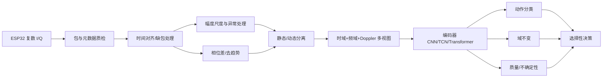
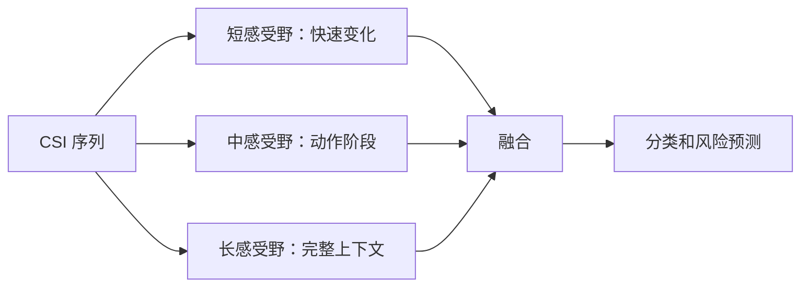
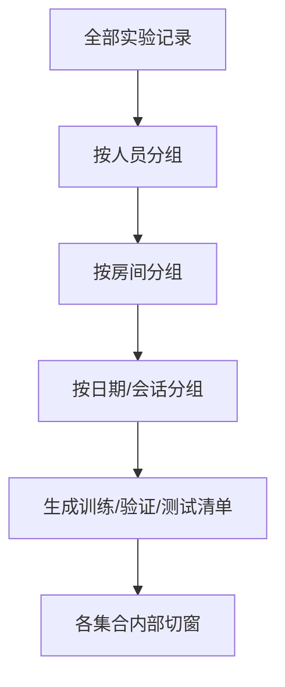

# Wi-Fi CSI 深度学习路线：从信号到可信模式识别

## 1. CSI 不是普通数字矩阵

OFDM 子载波 \(k\) 在时刻/包 \(t\) 的复数 CSI：

\[
H_k(t)=I_k(t)+jQ_k(t)=|H_k(t)|e^{j\phi_k(t)}
\]

多径形式可简化为：

\[
H(f,t)=\sum_{\ell=1}^{L}a_\ell(t)
e^{-j2\pi f\tau_\ell(t)}
\]

人体运动改变动态路径的幅度、时延和相位，从而在时间、子载波和 Doppler 域留下模式。

## 2. 原始相位为何不能直接当传播相位

测量值可抽象为：

\[
\hat H_{t,k}=A_tH_{t,k}
e^{j(\phi_t+\alpha_t k)}+n_{t,k}
\]

- \(A_t\)：AGC 等幅度尺度；
- \(\phi_t\)：CFO、公共相位和包检测产生的包间旋转；
- \(\alpha_tk\)：SFO/包检测延迟导致的跨子载波近似线性相位斜率；
- \(n\)：噪声、量化和干扰。

因此单天线、非同步 ESP32 的 `atan2(Q,I)` 通常不能直接解释为绝对传播相位。应优先研究相位差、去线性趋势相位、共轭乘积、动态分量和有效 Doppler。

## 3. 数据通路

## 4. 推荐输入通道

可按实际数据质量逐步增加：

1. 对数幅度或稳健归一化幅度；
2. 时间差分幅度；
3. 静态趋势与动态残差；
4. 相邻子载波共轭相位差；
5. 时间共轭差分；
6. 去线性趋势相位的 sin/cos；
7. STFT/Doppler 能量；
8. RSSI、噪声、信道、MCS、包间隔、丢包率等质量元数据。

不要把所有通道无选择堆入模型。每种表示都应做独立质量检查和消融。

## 5. 为什么多尺度时序骨干合适

跌倒包含不同时间尺度：

- 很短的快速冲击；
- 中等时长的姿态转换；
- 更长的动作前后静止状态。

多尺度 CNN/TCN 可以使用不同卷积核或 dilation：

## 6. 何时加入 Transformer

适合：

- 序列中远距离阶段关系重要；
- 多子载波或多接收器交互重要；
- 有足够独立人员、房间、日期数据；
- 自监督预训练数据量大；
- 算力允许。

建议先用卷积做局部提取和降采样，再用轻量 Transformer。与纯 TCN、纯 Transformer 做同预算比较。

## 7. 跨人员与跨房间

域变量包括：人员、房间、日期、发射/接收设备、摆放位置和朝向。

训练目标可写为：

\[
\mathcal L=mathcal L_{cls}
+\lambda_{dom}\mathcal L_{dom}
+\lambda_{phy}\mathcal L_{phy}
\]

若使用梯度反转，域分类器最小化域损失，而编码器接收反向域梯度，尝试去除域可辨认信息。注意：完全抹掉域信息可能同时损失动作信息，需要权衡。

## 8. 信号质量建模

质量特征可包含：

- 丢包率和包间隔抖动；
- RSSI/噪声变化；
- 饱和、裁剪、全零或异常子载波比例；
- 有效子载波数；
- AGC/幅度突变；
- 相位拟合残差；
- 模型多次预测分歧。

质量分数不是“正确率”的同义词，应通过低质量分组错误率、校准和拒识曲线验证。

## 9. DQSNet 和 PG-DQSNet 的角色

- DQSNet：围绕 Domain、Quality、Selective prediction 构建的任务框架；
- PG-DQSNet：在上述框架中加入物理合理的 CSI 表示、结构或一致性约束；
- Backbone：可以是 TCN、CNN-Transformer 或其他编码器；
- 它不是必须排斥 Transformer。

## 10. 训练方案示例

### 阶段 A：数据质检

检查原始 I/Q、子载波顺序、时间戳、缺包、元数据和标签对齐。

### 阶段 B：自监督预训练（可选）

遮挡恢复、时间一致性或物理合理的对比学习。

### 阶段 C：监督分类

先训练 backbone + class head，确保基础任务有效。

### 阶段 D：域与质量分支

逐步加入域对抗、质量分支和不确定性，观察是否改善真正独立域。

### 阶段 E：选择性预测

在验证集设定覆盖率/风险阈值，再在测试集固定评估。

## 11. 必须做的划分

先按记录级元数据划分，再在各集合内切窗。任何重叠窗口不能跨集合。

## 12. 基线与消融

基线：统计特征+SVM/RF、1D CNN、ResNet1D、GRU、TCN、轻量 Transformer、CNN-Transformer。

消融：幅度-only、+相位差、+Doppler、+物理一致性、+域分支、+质量分支、+选择性头。

## 13. 论文应避免的表述

- 不要把原始 ESP32 绝对相位称为真实传播相位；
- 不要把随机窗口划分称为跨人员泛化；
- 不要把普通平滑损失无依据称为物理方程；
- 不要把 PG-DQSNet 称为已经证明优于 Transformer；
- 不要只用二维可视化图证明域不变；
- 不要用生成数据替代真实目标域测试。

## 14. 面向 Pattern Recognition 的研究重点

更有说服力的问题不是“网络层数更多”，而是：

1. 动作模式在域变化下怎样保持可识别；
2. 无线物理先验怎样减少伪相关；
3. 低质量和未知样本怎样安全拒识；
4. 置信度能否校准；
5. 模块改善是否在跨人员、跨房间实验中稳定复现。

